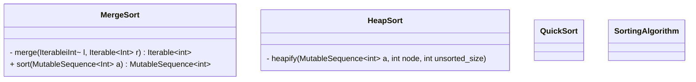

```mermaid
classDiagram

    class MergeSort {
        - merge (IterableiInt~ l, Iterable~Int~ r) Iterable~int~
        + sort (MutableSequence~Int~ a) MutableSequence~int~
    }
    
    class HeapSort{
        - heapify (MutableSequence~int~ a, int node, int unsorted_size)
        
    }
    
    class QuickSort{}
    
    class SortingAlgorithm{}
    
```
