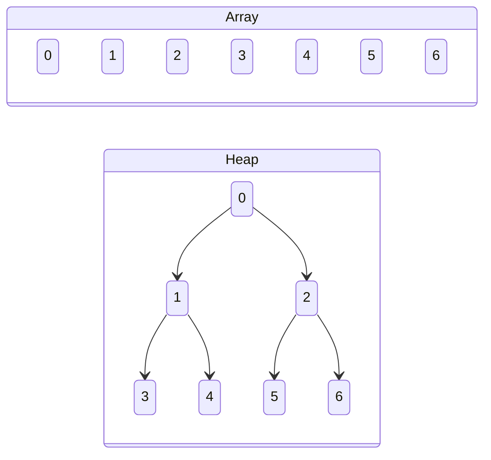
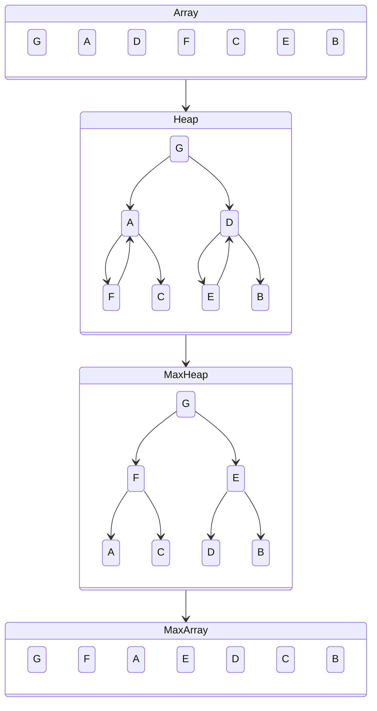
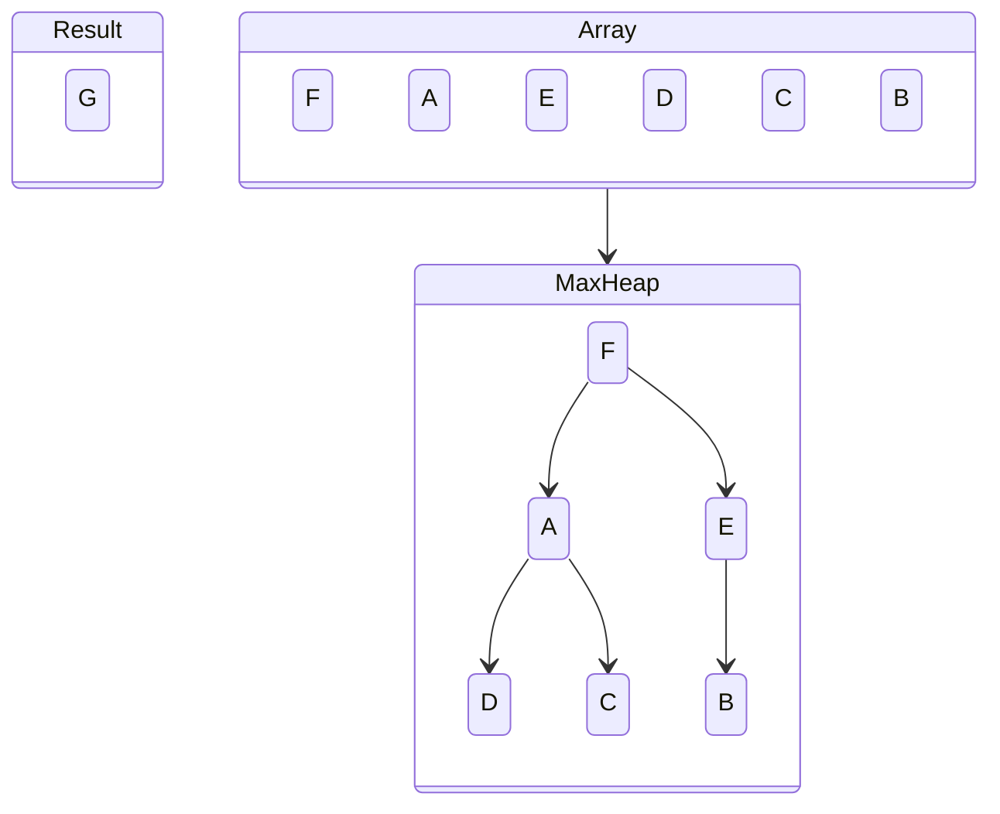
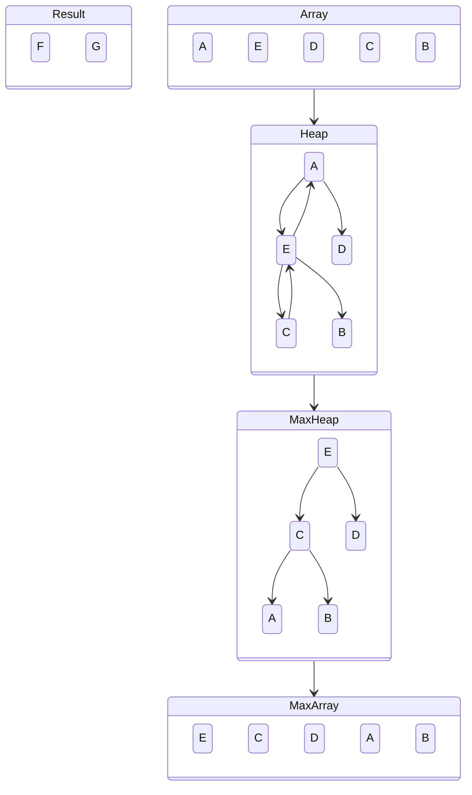
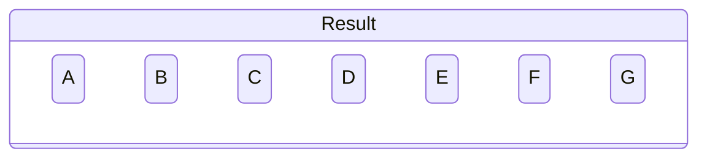
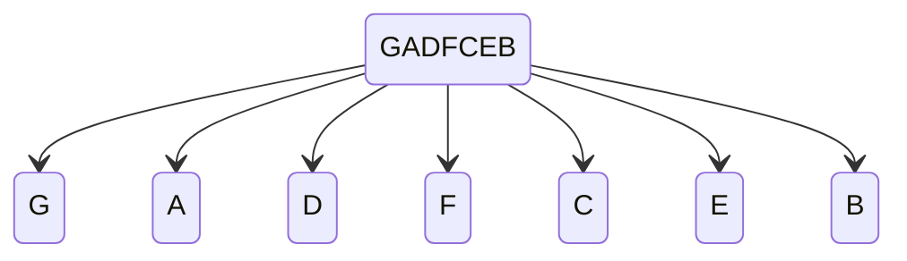
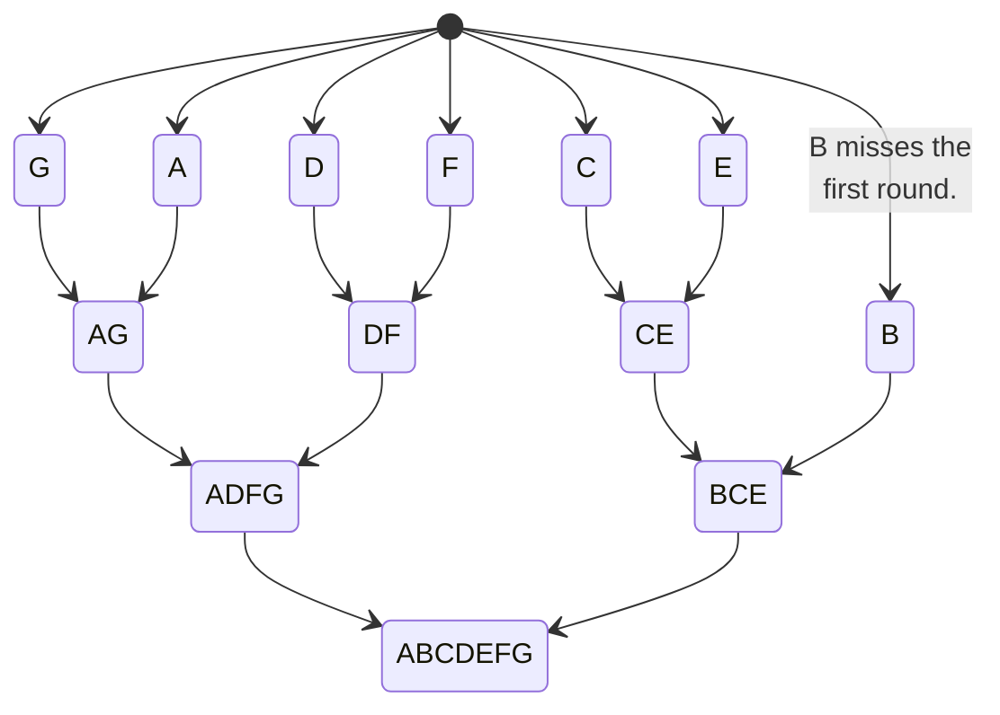
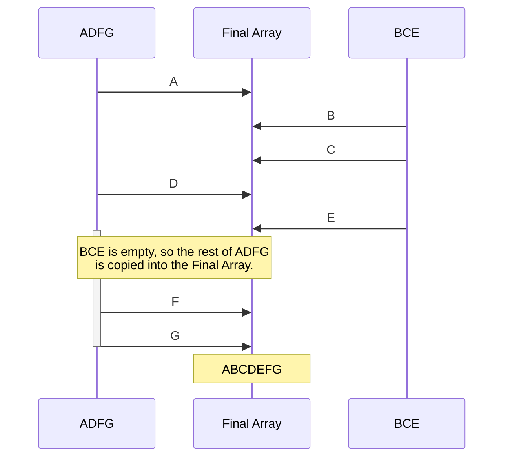

## Algorithms Summary

### Heap Sort

Heap sort is a two-phase algorithm that treats the input array as a binary tree in which the children of element $i$ are located at index $2i+1$ and $2i+2$.

#### Max Heapification

The first phase of heap sort is to convert the heap structure into a max heap. This means that every parent is greater than either of its children.

#### Partial Heapification

After the process of max heapification, the greatest item in the entire array will be at the top of the heap. Take that item off and put it at the beginning of the result array. Now, to get the next largest item, rather than doing a full heapification, only a partial heapification of just the elements effected by the change in the structure of the heap is necessary.

In this case there is nothing to do because F is greater than both of its children. Repeat.

E is greater than both A and D, so it gets swapped with A. Next, look at the part of the tree that was just affected. C is greater than both A and B, so C swaps with A.

This process continues similarly until the entire source array is empty.

### Merge Sort

The merge sort algorithm has two phases. The second and more significant phase deals with merging multiple small sorted arrays into one large sorted array, hence the name 'merge sort'. Combining two already sorted arrays in this way is trivial, and merge sort seeks to take advantage of that.

#### Splitting

The first phase consists of moving each element into its own array.

#### Merging

The second phase is done iteratively over all the elements in the array, combining them together in groups of two at a time until there is only one left.

The merging is done by pulling from whichever side has the smaller element next.

## Methods

### Permutation Generation

Permutations were generated using Python's built-in `itertools.permutations` function. We feed it `range(i)` for every `i` in the list of permutation sizes to use, in this case 4, 6, and 8.

### Comparison Counting

All of our are implemented in classes that inherit from the abstract `SortingAlgorithm` class. This class exposes both `compareLeast` and `compareMost`. All comparisons that the algorithms do between elements in the input array use these functions. Each time one of these functions is called, an internal `_comparison_count` variable is incremented. When the sort is finished, this variable can be checked to determine the total number of comparisons performed during that sort operation.

### Ensuring Fairness Across Algorithms

To ensure fairness across algorithms, the same `_analyze` function is used to instatiate, execute, and retrieve comparison count results from each algorithm. This way, if there is a bug outside any individual algorithm, then it wil affect all algorithms, not just one or two of them.

To ensure fairness within algorithms, we used the `SortingAlgorithm` parent class for all of them to make sure that they all count comparisons the same way.

One complication to this is the implementation of quicksort. While the others have limited leeway in how they can be implemented, quicksort has many different approaches, many of which can impact the comparison counts. To keep things fair, we chose to use a common approach to pivot selection in quicksort with the idea that it would give us typical performance for the algorithm in most cases. 

## Results

### Mergesort

---

#### 4 Elements - 24 Permutations

**Average Case:**

> $4.67$ element comparisons

**10 Worst Cases:**

| $5$            | $5$            | $5$            | $5$            | $5$            |
| -------------- | -------------- | -------------- | -------------- | -------------- |
| $(1, 3, 0, 2)$ | $(1, 3, 2, 0)$ | $(2, 0, 1, 3)$ | $(2, 0, 3, 1)$ | $(2, 1, 0, 3)$ |

| $5$            | $5$            | $5$            | $5$            | $5$            |
| -------------- | -------------- | -------------- | -------------- | -------------- |
| $(2, 1, 3, 0)$ | $(3, 0, 1, 2)$ | $(3, 0, 2, 1)$ | $(3, 1, 0, 2)$ | $(3, 1, 2, 0)$ |

**10 Best Cases:**

| $4$            | $4$            | $4$            | $4$            | $4$            |
| -------------- | -------------- | -------------- | -------------- | -------------- |
| $(0, 1, 2, 3)$ | $(0, 1, 3, 2)$ | $(1, 0, 2, 3)$ | $(1, 0, 3, 2)$ | $(2, 3, 0, 1)$ |

| $4$            | $4$            | $4$            | $5$            | $5$            |
| -------------- | -------------- | -------------- | -------------- | -------------- |
| $(2, 3, 1, 0)$ | $(3, 2, 0, 1)$ | $(3, 2, 1, 0)$ | $(0, 2, 1, 3)$ | $(0, 2, 3, 1)$ |

---

#### 6 Elements - 720 Permutations

**Average Case:**

> $9.93$ element comparisons

**10 Worst Cases:**

| $11$                 | $11$                 | $11$                 | $11$                 | $11$                 |
| -------------------- | -------------------- | -------------------- | -------------------- | -------------------- |
| $(5, 1, 3, 2, 0, 4)$ | $(5, 1, 3, 2, 4, 0)$ | $(5, 2, 0, 3, 1, 4)$ | $(5, 2, 0, 3, 4, 1)$ | $(5, 2, 1, 3, 0, 4)$ |

| $11$                 | $11$                 | $11$                 | $11$                 | $11$                 |
| -------------------- | -------------------- | -------------------- | -------------------- | -------------------- |
| $(5, 2, 1, 3, 4, 0)$ | $(5, 2, 3, 0, 1, 4)$ | $(5, 2, 3, 0, 4, 1)$ | $(5, 2, 3, 1, 0, 4)$ | $(5, 2, 3, 1, 4, 0)$ |

**10 Best Cases:**

| $7$                  | $7$                  | $7$                  | $7$                  | $7$                  |
| -------------------- | -------------------- | -------------------- | -------------------- | -------------------- |
| $(2, 3, 4, 5, 0, 1)$ | $(2, 3, 4, 5, 1, 0)$ | $(2, 3, 5, 4, 0, 1)$ | $(2, 3, 5, 4, 1, 0)$ | $(3, 2, 4, 5, 0, 1)$ |

| $7$                  | $7$                  | $7$                  | $7$                  | $7$                  |
| -------------------- | -------------------- | -------------------- | -------------------- | -------------------- |
| $(3, 2, 4, 5, 1, 0)$ | $(3, 2, 5, 4, 0, 1)$ | $(3, 2, 5, 4, 1, 0)$ | $(4, 5, 2, 3, 0, 1)$ | $(4, 5, 2, 3, 1, 0)$ |

---

#### 8 Elements - 40320 Permutations

**Average Case:**

> $15.73$ element comparisons

**10 Worst Cases:**

| $17$                       | $17$                       | $17$                       | $17$                       | $17$                       |
| -------------------------- | -------------------------- | -------------------------- | -------------------------- | -------------------------- |
| $(7, 4, 5, 3, 1, 6, 0, 2)$ | $(7, 4, 5, 3, 1, 6, 2, 0)$ | $(7, 4, 5, 3, 2, 0, 1, 6)$ | $(7, 4, 5, 3, 2, 0, 6, 1)$ | $(7, 4, 5, 3, 2, 1, 0, 6)$ |

| $17$                       | $17$                       | $17$                       | $17$                       | $17$                       |
| -------------------------- | -------------------------- | -------------------------- | -------------------------- | -------------------------- |
| $(7, 4, 5, 3, 2, 1, 6, 0)$ | $(7, 4, 5, 3, 6, 0, 1, 2)$ | $(7, 4, 5, 3, 6, 0, 2, 1)$ | $(7, 4, 5, 3, 6, 1, 0, 2)$ | $(7, 4, 5, 3, 6, 1, 2, 0)$ |

**10 Best Cases:**

| $12$                       | $12$                       | $12$                       | $12$                       | $12$                       |
| -------------------------- | -------------------------- | -------------------------- | -------------------------- | -------------------------- |
| $(0, 1, 2, 3, 4, 5, 6, 7)$ | $(0, 1, 2, 3, 4, 5, 7, 6)$ | $(0, 1, 2, 3, 5, 4, 6, 7)$ | $(0, 1, 2, 3, 5, 4, 7, 6)$ | $(0, 1, 2, 3, 6, 7, 4, 5)$ |

| $12$                       | $12$                       | $12$                       | $12$                       | $12$                       |
| -------------------------- | -------------------------- | -------------------------- | -------------------------- | -------------------------- |
| $(0, 1, 2, 3, 6, 7, 5, 4)$ | $(0, 1, 2, 3, 7, 6, 4, 5)$ | $(0, 1, 2, 3, 7, 6, 5, 4)$ | $(0, 1, 3, 2, 4, 5, 6, 7)$ | $(0, 1, 3, 2, 4, 5, 7, 6)$ |

---

### Heapsort

---

#### 4 Elements - 24 Permutations

**Average Case:**

> $8.50$ element comparisons

**10 Worst Cases:**

| $9$            | $9$            | $9$            | $9$            | $9$            |
| -------------- | -------------- | -------------- | -------------- | -------------- |
| $(0, 3, 1, 2)$ | $(0, 3, 2, 1)$ | $(1, 0, 2, 3)$ | $(1, 2, 0, 3)$ | $(1, 3, 0, 2)$ |

| $9$            | $9$            | $9$            | $9$            | $9$            |
| -------------- | -------------- | -------------- | -------------- | -------------- |
| $(1, 3, 2, 0)$ | $(2, 0, 1, 3)$ | $(2, 1, 0, 3)$ | $(2, 3, 0, 1)$ | $(2, 3, 1, 0)$ |

**10 Best Cases:**

| $8$            | $8$            | $8$            | $8$            | $8$            |
| -------------- | -------------- | -------------- | -------------- | -------------- |
| $(0, 1, 3, 2)$ | $(0, 2, 3, 1)$ | $(1, 0, 3, 2)$ | $(1, 2, 3, 0)$ | $(2, 0, 3, 1)$ |

| $8$            | $8$            | $8$            | $8$            | $8$            |
| -------------- | -------------- | -------------- | -------------- | -------------- |
| $(2, 1, 3, 0)$ | $(3, 0, 1, 2)$ | $(3, 0, 2, 1)$ | $(3, 1, 0, 2)$ | $(3, 1, 2, 0)$ |

---

#### 6 Elements - 720 Permutations

**Average Case:**

> $17.13$ element comparisons

**10 Worst Cases:**

| $19$                 | $19$                 | $19$                 | $19$                 | $19$                 |
| -------------------- | -------------------- | -------------------- | -------------------- | -------------------- |
| $(4, 5, 0, 3, 1, 2)$ | $(4, 5, 0, 3, 2, 1)$ | $(4, 5, 1, 0, 3, 2)$ | $(4, 5, 1, 2, 3, 0)$ | $(4, 5, 1, 3, 0, 2)$ |

| $19$                 | $19$                 | $19$                 | $19$                 | $19$                 |
| -------------------- | -------------------- | -------------------- | -------------------- | -------------------- |
| $(4, 5, 1, 3, 2, 0)$ | $(4, 5, 2, 0, 3, 1)$ | $(4, 5, 2, 1, 3, 0)$ | $(4, 5, 2, 3, 0, 1)$ | $(4, 5, 2, 3, 1, 0)$ |

**10 Best Cases:**

| $14$                 | $14$                 | $14$                 | $14$                 | $14$                 |
| -------------------- | -------------------- | -------------------- | -------------------- | -------------------- |
| $(5, 0, 3, 1, 2, 4)$ | $(5, 0, 3, 2, 1, 4)$ | $(5, 0, 4, 1, 2, 3)$ | $(5, 0, 4, 2, 1, 3)$ | $(5, 1, 3, 0, 2, 4)$ |

| $14$                 | $14$                 | $14$                 | $14$                 | $14$                 |
| -------------------- | -------------------- | -------------------- | -------------------- | -------------------- |
| $(5, 1, 3, 2, 0, 4)$ | $(5, 1, 4, 0, 2, 3)$ | $(5, 1, 4, 2, 0, 3)$ | $(5, 2, 3, 0, 1, 4)$ | $(5, 2, 3, 1, 0, 4)$ |

---

#### 8 Elements - 40320 Permutations

**Average Case:**

> $27.81$ element comparisons

**10 Worst Cases:**

| $31$                       | $31$                       | $31$                       | $31$                       | $31$                       |
| -------------------------- | -------------------------- | -------------------------- | -------------------------- | -------------------------- |
| $(5, 6, 1, 7, 4, 0, 2, 3)$ | $(5, 6, 1, 7, 4, 2, 0, 3)$ | $(5, 6, 2, 3, 4, 0, 1, 7)$ | $(5, 6, 2, 3, 4, 1, 0, 7)$ | $(5, 6, 2, 4, 3, 0, 1, 7)$ |

| $31$                       | $31$                       | $31$                       | $31$                       | $31$                       |
| -------------------------- | -------------------------- | -------------------------- | -------------------------- | -------------------------- |
| $(5, 6, 2, 4, 3, 1, 0, 7)$ | $(5, 6, 2, 7, 3, 0, 1, 4)$ | $(5, 6, 2, 7, 3, 1, 0, 4)$ | $(5, 6, 2, 7, 4, 0, 1, 3)$ | $(5, 6, 2, 7, 4, 1, 0, 3)$ |

**10 Best Cases:**

| $23$                       | $23$                       | $23$                       | $23$                       | $23$                       |
| -------------------------- | -------------------------- | -------------------------- | -------------------------- | -------------------------- |
| $(7, 0, 3, 1, 6, 4, 5, 2)$ | $(7, 0, 3, 1, 6, 5, 4, 2)$ | $(7, 0, 3, 2, 6, 4, 5, 1)$ | $(7, 0, 3, 2, 6, 5, 4, 1)$ | $(7, 0, 4, 1, 6, 3, 5, 2)$ |

| $23$                       | $23$                       | $23$                       | $23$                       | $23$                       |
| -------------------------- | -------------------------- | -------------------------- | -------------------------- | -------------------------- |
| $(7, 0, 4, 1, 6, 5, 3, 2)$ | $(7, 0, 4, 2, 6, 3, 5, 1)$ | $(7, 0, 4, 2, 6, 5, 3, 1)$ | $(7, 0, 5, 1, 6, 3, 4, 2)$ | $(7, 0, 5, 1, 6, 4, 3, 2)$ |

---

### Quicksort

---

#### 4 Elements - 24 Permutations

**Average Case:**

> $7.17$ element comparisons

**10 Worst Cases:**

| $7$            | $7$            | $9$            | $9$            | $9$            |
| -------------- | -------------- | -------------- | -------------- | -------------- |
| $(2, 1, 3, 0)$ | $(2, 3, 1, 0)$ | $(0, 1, 2, 3)$ | $(1, 0, 2, 3)$ | $(1, 2, 0, 3)$ |

| $9$            | $9$            | $9$            | $9$            | $9$            |
| -------------- | -------------- | -------------- | -------------- | -------------- |
| $(1, 2, 3, 0)$ | $(1, 3, 2, 0)$ | $(2, 1, 0, 3)$ | $(3, 1, 2, 0)$ | $(3, 2, 1, 0)$ |

**10 Best Cases:**

| $6$            | $6$            | $6$            | $6$            | $6$            |
| -------------- | -------------- | -------------- | -------------- | -------------- |
| $(0, 1, 3, 2)$ | $(0, 2, 3, 1)$ | $(0, 3, 1, 2)$ | $(0, 3, 2, 1)$ | $(1, 0, 3, 2)$ |

| $6$            | $6$            | $6$            | $6$            | $6$            |
| -------------- | -------------- | -------------- | -------------- | -------------- |
| $(1, 3, 0, 2)$ | $(2, 0, 3, 1)$ | $(2, 3, 0, 1)$ | $(3, 0, 1, 2)$ | $(3, 0, 2, 1)$ |

---

#### 6 Elements - 720 Permutations

**Average Case:**

> $13.97$ element comparisons

**10 Worst Cases:**

| $20$                 | $20$                 | $20$                 | $20$                 | $20$                 |
| -------------------- | -------------------- | -------------------- | -------------------- | -------------------- |
| $(4, 2, 3, 1, 0, 5)$ | $(4, 3, 2, 1, 0, 5)$ | $(5, 1, 2, 3, 4, 0)$ | $(5, 2, 1, 3, 4, 0)$ | $(5, 2, 3, 1, 4, 0)$ |

| $20$                 | $20$                 | $20$                 | $20$                 | $20$                 |
| -------------------- | -------------------- | -------------------- | -------------------- | -------------------- |
| $(5, 2, 3, 4, 1, 0)$ | $(5, 2, 4, 3, 1, 0)$ | $(5, 3, 2, 1, 4, 0)$ | $(5, 4, 2, 3, 1, 0)$ | $(5, 4, 3, 2, 1, 0)$ |

**10 Best Cases:**

| $11$                 | $11$                 | $11$                 | $11$                 | $11$                 |
| -------------------- | -------------------- | -------------------- | -------------------- | -------------------- |
| $(0, 1, 4, 3, 5, 2)$ | $(0, 1, 4, 5, 3, 2)$ | $(0, 2, 1, 4, 5, 3)$ | $(0, 2, 1, 5, 4, 3)$ | $(0, 2, 4, 1, 5, 3)$ |

| $11$                 | $11$                 | $11$                 | $11$                 | $11$                 |
| -------------------- | -------------------- | -------------------- | -------------------- | -------------------- |
| $(0, 2, 4, 5, 1, 3)$ | $(0, 2, 5, 1, 4, 3)$ | $(0, 2, 5, 4, 1, 3)$ | $(0, 3, 4, 1, 5, 2)$ | $(0, 3, 4, 5, 1, 2)$ |

---

#### 8 Elements - 40320 Permutations

**Average Case:**

> $21.92$ element comparisons

**10 Worst Cases:**

| $35$                       | $35$                       | $35$                       | $35$                       | $35$                       |
| -------------------------- | -------------------------- | -------------------------- | -------------------------- | -------------------------- |
| $(7, 5, 3, 4, 2, 1, 6, 0)$ | $(7, 5, 4, 3, 2, 1, 6, 0)$ | $(7, 6, 2, 3, 4, 5, 1, 0)$ | $(7, 6, 3, 2, 4, 5, 1, 0)$ | $(7, 6, 3, 4, 2, 5, 1, 0)$ |

| $35$                       | $35$                       | $35$                       | $35$                       | $35$                       |
| -------------------------- | -------------------------- | -------------------------- | -------------------------- | -------------------------- |
| $(7, 6, 3, 4, 5, 2, 1, 0)$ | $(7, 6, 3, 5, 4, 2, 1, 0)$ | $(7, 6, 4, 3, 2, 5, 1, 0)$ | $(7, 6, 5, 3, 4, 2, 1, 0)$ | $(7, 6, 5, 4, 3, 2, 1, 0)$ |

**10 Best Cases:**

| $17$                       | $17$                       | $17$                       | $17$                       | $17$                       |
| -------------------------- | -------------------------- | -------------------------- | -------------------------- | -------------------------- |
| $(0, 1, 3, 2, 6, 5, 7, 4)$ | $(0, 1, 3, 2, 6, 7, 5, 4)$ | $(0, 1, 3, 5, 6, 2, 7, 4)$ | $(0, 1, 3, 5, 6, 7, 2, 4)$ | $(0, 1, 3, 6, 2, 5, 7, 4)$ |

| $17$                       | $17$                       | $17$                       | $17$                       | $17$                       |
| -------------------------- | -------------------------- | -------------------------- | -------------------------- | -------------------------- |
| $(0, 1, 3, 6, 2, 7, 5, 4)$ | $(0, 1, 3, 7, 6, 2, 5, 4)$ | $(0, 1, 3, 7, 6, 5, 2, 4)$ | $(0, 1, 5, 3, 6, 2, 7, 4)$ | $(0, 1, 5, 3, 6, 7, 2, 4)$ |

---

### Shakersort

---

#### 4 Elements - 24 Permutations

**Average Case:**

> $15.00$ element comparisons

**10 Worst Cases:**

| $15$           | $15$           | $15$           | $15$           | $15$           |
| -------------- | -------------- | -------------- | -------------- | -------------- |
| $(2, 1, 0, 3)$ | $(2, 1, 3, 0)$ | $(2, 3, 0, 1)$ | $(2, 3, 1, 0)$ | $(3, 0, 1, 2)$ |

| $15$           | $15$           | $15$           | $15$           | $15$           |
| -------------- | -------------- | -------------- | -------------- | -------------- |
| $(3, 0, 2, 1)$ | $(3, 1, 0, 2)$ | $(3, 1, 2, 0)$ | $(3, 2, 0, 1)$ | $(3, 2, 1, 0)$ |

**10 Best Cases:**

| $15$           | $15$           | $15$           | $15$           | $15$           |
| -------------- | -------------- | -------------- | -------------- | -------------- |
| $(0, 1, 2, 3)$ | $(0, 1, 3, 2)$ | $(0, 2, 1, 3)$ | $(0, 2, 3, 1)$ | $(0, 3, 1, 2)$ |

| $15$           | $15$           | $15$           | $15$           | $15$           |
| -------------- | -------------- | -------------- | -------------- | -------------- |
| $(0, 3, 2, 1)$ | $(1, 0, 2, 3)$ | $(1, 0, 3, 2)$ | $(1, 2, 0, 3)$ | $(1, 2, 3, 0)$ |

---

#### 6 Elements - 720 Permutations

**Average Case:**

> $30.00$ element comparisons

**10 Worst Cases:**

| $30$                 | $30$                 | $30$                 | $30$                 | $30$                 |
| -------------------- | -------------------- | -------------------- | -------------------- | -------------------- |
| $(5, 4, 2, 1, 0, 3)$ | $(5, 4, 2, 1, 3, 0)$ | $(5, 4, 2, 3, 0, 1)$ | $(5, 4, 2, 3, 1, 0)$ | $(5, 4, 3, 0, 1, 2)$ |

| $30$                 | $30$                 | $30$                 | $30$                 | $30$                 |
| -------------------- | -------------------- | -------------------- | -------------------- | -------------------- |
| $(5, 4, 3, 0, 2, 1)$ | $(5, 4, 3, 1, 0, 2)$ | $(5, 4, 3, 1, 2, 0)$ | $(5, 4, 3, 2, 0, 1)$ | $(5, 4, 3, 2, 1, 0)$ |

**10 Best Cases:**

| $30$                 | $30$                 | $30$                 | $30$                 | $30$                 |
| -------------------- | -------------------- | -------------------- | -------------------- | -------------------- |
| $(0, 1, 2, 3, 4, 5)$ | $(0, 1, 2, 3, 5, 4)$ | $(0, 1, 2, 4, 3, 5)$ | $(0, 1, 2, 4, 5, 3)$ | $(0, 1, 2, 5, 3, 4)$ |

| $30$                 | $30$                 | $30$                 | $30$                 | $30$                 |
| -------------------- | -------------------- | -------------------- | -------------------- | -------------------- |
| $(0, 1, 2, 5, 4, 3)$ | $(0, 1, 3, 2, 4, 5)$ | $(0, 1, 3, 2, 5, 4)$ | $(0, 1, 3, 4, 2, 5)$ | $(0, 1, 3, 4, 5, 2)$ |

---

#### 8 Elements - 40320 Permutations

**Average Case:**

> $50.00$ element comparisons

**10 Worst Cases:**

| $50$                       | $50$                       | $50$                       | $50$                       | $50$                       |
| -------------------------- | -------------------------- | -------------------------- | -------------------------- | -------------------------- |
| $(7, 6, 5, 4, 2, 1, 0, 3)$ | $(7, 6, 5, 4, 2, 1, 3, 0)$ | $(7, 6, 5, 4, 2, 3, 0, 1)$ | $(7, 6, 5, 4, 2, 3, 1, 0)$ | $(7, 6, 5, 4, 3, 0, 1, 2)$ |

| $50$                       | $50$                       | $50$                       | $50$                       | $50$                       |
| -------------------------- | -------------------------- | -------------------------- | -------------------------- | -------------------------- |
| $(7, 6, 5, 4, 3, 0, 2, 1)$ | $(7, 6, 5, 4, 3, 1, 0, 2)$ | $(7, 6, 5, 4, 3, 1, 2, 0)$ | $(7, 6, 5, 4, 3, 2, 0, 1)$ | $(7, 6, 5, 4, 3, 2, 1, 0)$ |

**10 Best Cases:**

| $50$                       | $50$                       | $50$                       | $50$                       | $50$                       |
| -------------------------- | -------------------------- | -------------------------- | -------------------------- | -------------------------- |
| $(0, 1, 2, 3, 4, 5, 6, 7)$ | $(0, 1, 2, 3, 4, 5, 7, 6)$ | $(0, 1, 2, 3, 4, 6, 5, 7)$ | $(0, 1, 2, 3, 4, 6, 7, 5)$ | $(0, 1, 2, 3, 4, 7, 5, 6)$ |

| $50$                       | $50$                       | $50$                       | $50$                       | $50$                       |
| -------------------------- | -------------------------- | -------------------------- | -------------------------- | -------------------------- |
| $(0, 1, 2, 3, 4, 7, 6, 5)$ | $(0, 1, 2, 3, 5, 4, 6, 7)$ | $(0, 1, 2, 3, 5, 4, 7, 6)$ | $(0, 1, 2, 3, 5, 6, 4, 7)$ | $(0, 1, 2, 3, 5, 6, 7, 4)$ |

---

## Conclusion

### Reflection

#### Thaddeus Schelp

Todd introduced me to the idea of 'Who does What by When'. This is a useful way to think about organizing tasks and divvying them up. Making sure that you are actively aware of each of these Ws can help drive a team and keep them coordinated on tasks.

#### Brayden Graham
Thaddeus Introduced me to Mermaid for making diagrams directly in Markdown, which I see as a great tool that I can implement into both personal and work Projects going forward to help me better show and update charts in my documentation more frequently instead of using services like lucidchart. I was introduced to OOP in Python, which I didn't know was possible in that language, since I've avoided Python altogether in favor of lower-level, non-interpreted languages.
