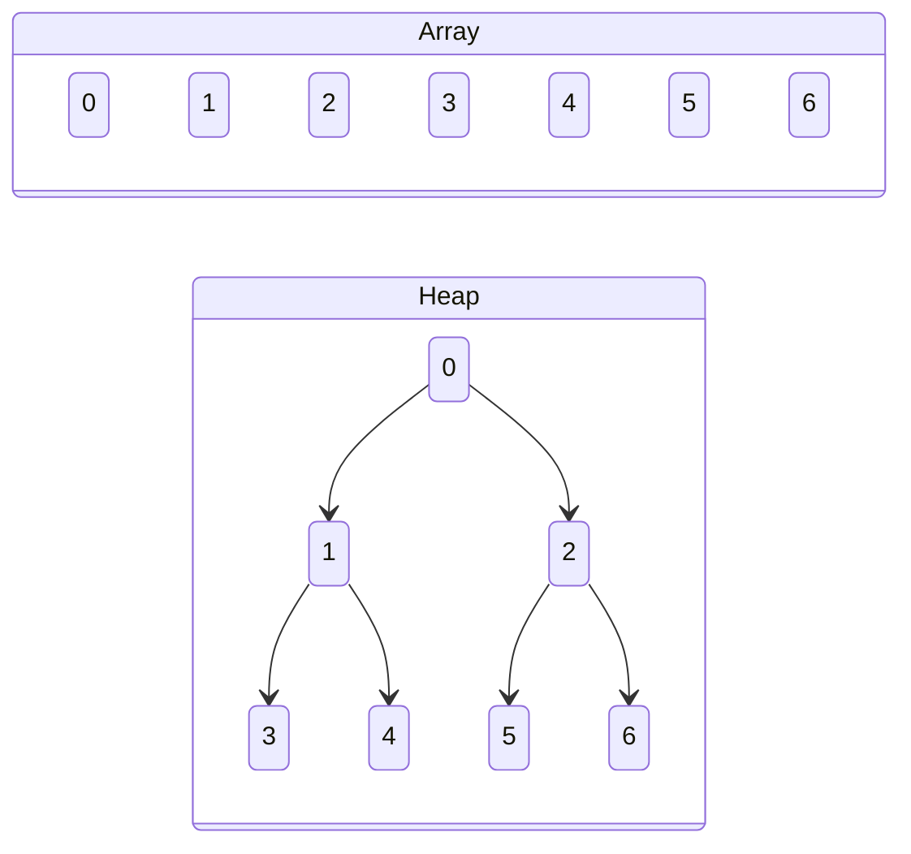
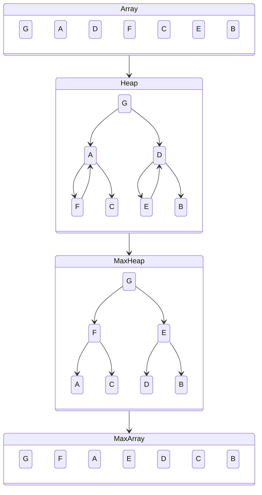
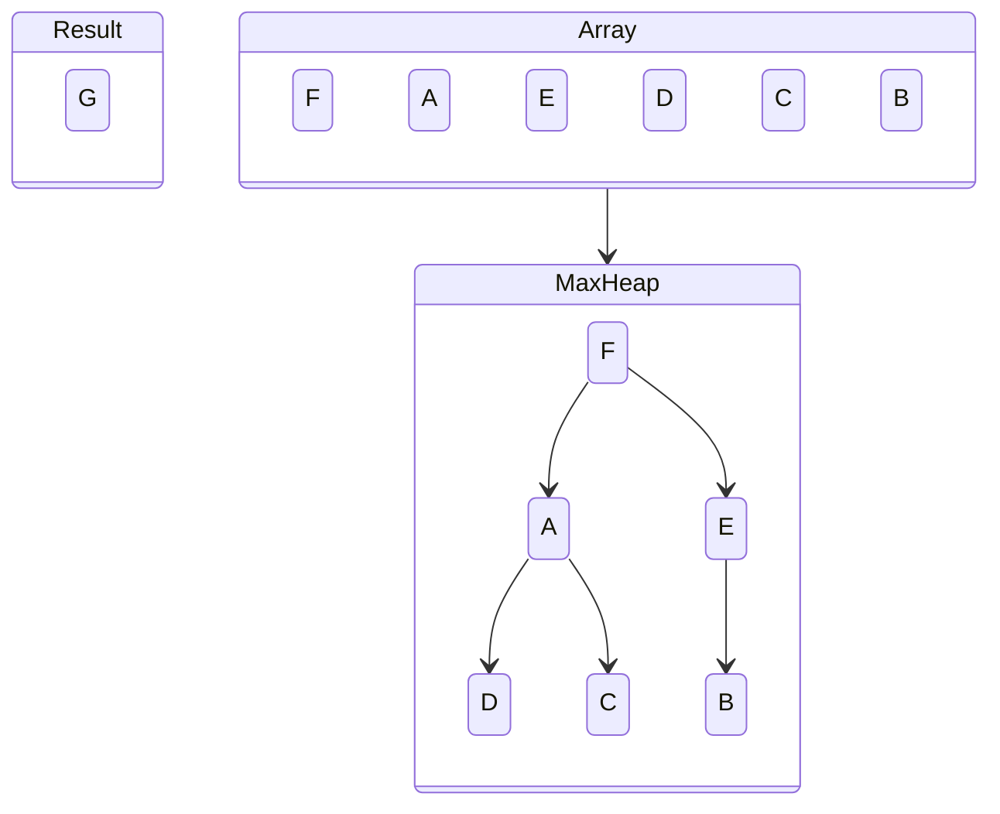
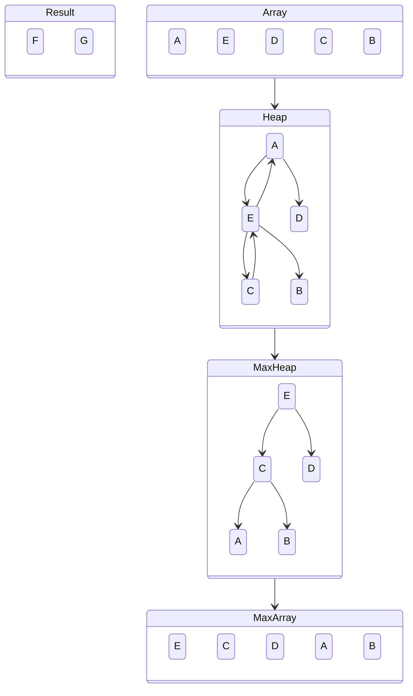
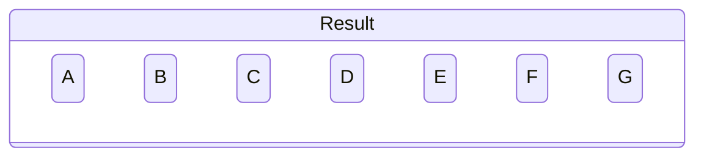
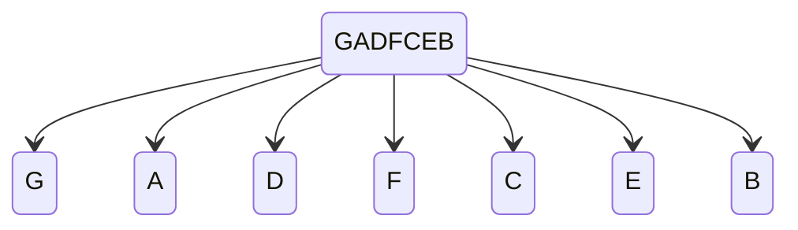
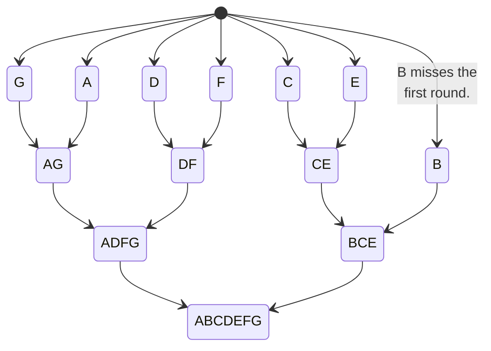
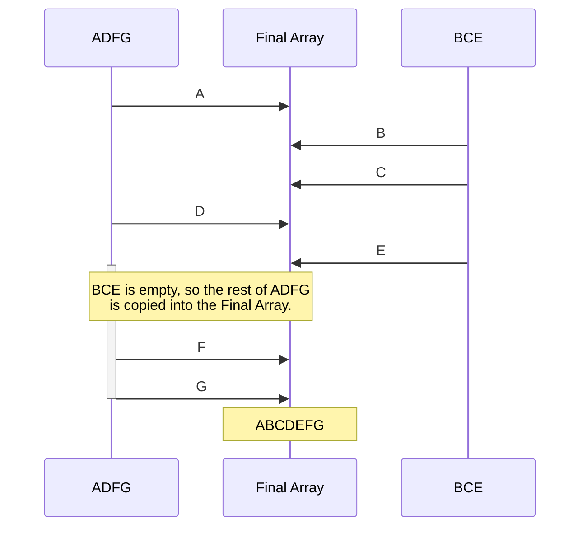

## Algorithms Summary

### Heap Sort

Heap sort is a two-phase algorithm that treats the input array as a binary tree in which the children of element $i$ are located at index $2i+1$ and $2i+2$.

#### Max Heapification

The first phase of heap sort is to convert the heap structure into a max heap. This means that every parent is greater than either of its children.

#### Partial Heapification

After the process of max heapification, the greatest item in the entire array will be at the top of the heap. Take that item off and put it at the beginning of the result array. Now, to get the next largest item, rather than doing a full heapification, only a partial heapification of just the elements effected by the change in the structure of the heap is necessary.

In this case there is nothing to do because F is greater than both of its children. Repeat.

E is greater than both A and D, so it gets swapped with A. Next, look at the part of the tree that was just affected. C is greater than both A and B, so C swaps with A.

This process continues similarly until the entire source array is empty.

### Merge Sort

The merge sort algorithm has two phases. The second and more significant phase deals with merging multiple small sorted arrays into one large sorted array, hence the name 'merge sort'. Combining two already sorted arrays in this way is trivial, and merge sort seeks to take advantage of that.

#### Splitting

The first phase consists of moving each element into its own array.

#### Merging

The second phase is done iteratively over all the elements in the array, combining them together in groups of two at a time until there is only one left.

The merging is done by pulling from whichever side has the smaller element next.

## Conclusion

### Reflection

#### Thaddeus Schelp

Todd introduced me to the idea of 'Who does What by When'. This is a useful way to think about organizing tasks and divvying them up. Making sure that you are actively aware of each of these Ws can help drive a team and keep them coordinated on tasks.
