# Coding Cadets CS 2430 Programming Project 1 Report 

## Coding Cadets

- Brayden Graham
- Thaddeus Schelp
- Todd Dharni

---

CS 2430, Semester 1, Programming Project 1

## Introduction

### Why Comparisons?

Comparisons are not a good proxy for sorting algorithm performance. They are only a small part of the algorithm, and not always the most significant. This can be proven by comparing real performance data gathered with from a profiler with the speculative performance data gathered by comparison counting.

---

Here are the profiling results of running each of the algorithms on the permutations required by the project. In the flamegraphs below, each vertical layer represents a stack frame. Each horizontal block represents the total sum of time spent on that point in the stack. Larger horizontal blocks are positioned further to the left and represent more time spent. The labels on the blocks correspond to the names of the relevant functions. Note that the `sort` functions are where each algorithm begins, and therefore these are what are being referred to when discussing a particular algorithm. 

Despite mergesort consistently having the fewest comparisons across all algorithms for any given permutation, it performs the worst by far. It spends >= ~600ms more than quicksort, the next slowest algorithm across multiple test runs.

To further back up my claim, here is another profile snapshot. This snapshot was captured using a single run for each algorithm in which they each sorted one million elements. Shakersort was left out because it took an unreasonable amount of time to finish.

In the test that generated the above snapshot:

| Algorithm  | Comparison Count |
| ---------- | ---------------- |
| Mergesort | $18716082$       |
| Quicksort | $25517011$       |
| Heapsort  | $36792758$       |

This clearly shows the discrepancy between comparison counts and actual performance even at large values of $N$. Mergesort still performs the worst, despite performing by far the fewest comparisons. Quicksort also performs worse than heapsort despite performing a fraction of the comparisons. Heapsort performs the best despite performing significantly more comparisons than any other algorithm.

---

Another argument against using comparisons is that because not all sorting algorithms use comparisons at all, using comparisons as a fundamental performance metric actually limits the types of algorithms that we can fairly analyze.

#### What Comparisons *Are* Useful For

Comparison counts can be great for comparing an algorithm to itself. This is primarily useful in two cases:

1. Relating an algorithm's performance to the input data it operates on.
2. Relating an algorithm's performance for small values of $N$ to its performance for large values of $N$.

### Why Permutations?

Using all possible permutations of $N$ values lets us analyze how the input data can affect the performance of an algorithm. Looking at every possible permutation reveals weak points or strong points in the algorithms. We see that some algorithms perform fewer comparisons when the input data is already sorted, or almost sorted. Others perform worse when the input data is reverse sorted or almost reverse sorted.

If we just selected a single random set of numbers, we might unfairly choose a set that performs better when sorted by one algorithm than any of the others, or worse, might give us different results every run. With that in mind, using multiple permutations ensures fairness when comparing different algorithms by enforcing unbiased input data.

### Why These Algorithms?

These four algorithms: mergesort, quicksort, heapsort, and shakersort, are the four that we were assigned. Aside from that, none of them are elementary sorts, and some like mergesort or quicksort are used in professional contexts. Another reason that other algorithms were not selected is that these all are comparison based, and therefore work with our comparison counting based performance analysis.

## Algorithms Summary

### Heapsort

Heapsort is a two-phase algorithm that treats the input array as a binary tree in which the children of element $i$ are located at index $2i+1$ and $2i+2$.

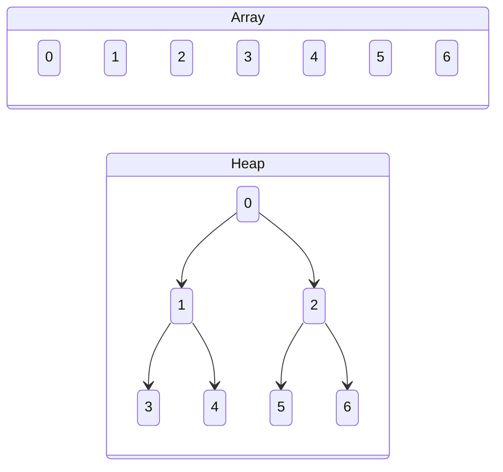
```mermaid
stateDiagram-v2
    direction LR
    state Array {
        zero: 0
        one: 1
        two: 2
        three: 3
        four: 4
        five: 5
        six: 6
    }
    state Heap {
        0 --> 1
        0 --> 2
        1 --> 3
        1 --> 4
        2 --> 5
        2 --> 6
    }
```

In the below examples, we will use alphabetic characters to represent the values in the array as distinct from their indices or placements in the heap. We treat 'A' as the lowest value character with each character in the alphabet having a value larger than the character before it.

#### Max Heapification

The first phase of heapsort is to convert the heap structure into a max heap. This means that every parent is greater than either of its children.

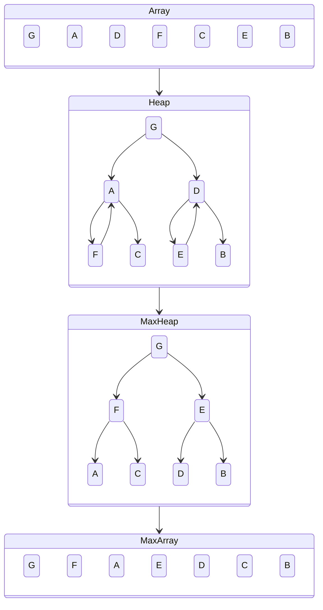
```mermaid
stateDiagram-v2
    state Array {
        g: G
        a: A
        d: D
        f: F
        c: C
        e: E
        b: B
    }
    state Heap {
        G --> A
        G --> D
        A --> F
        F --> A
        A --> C
        D --> E
        E --> D
        D --> B
    }
    state MaxHeap {
        GG: G
        FF: F
        AA: A
        EE: E
        DD: D
        CC: C
        BB: B
        GG --> FF
        GG --> EE
        FF --> AA
        FF --> CC
        EE --> DD
        EE --> BB
    }
    state MaxArray {
        gg: G
        ff: F
        aa: A
        ee: E
        dd: D
        cc: C
        bb: B
    }
    Array --> Heap
    Heap --> MaxHeap
    MaxHeap --> MaxArray
```

#### Partial Heapification

After the process of max heapification, the greatest item in the entire array will be at the top of the heap. Take that item off and put it at the beginning of the result array. Now, to get the next largest item, rather than doing a full heapification, only a partial heapification of just the elements effected by the change in the structure of the heap is necessary.

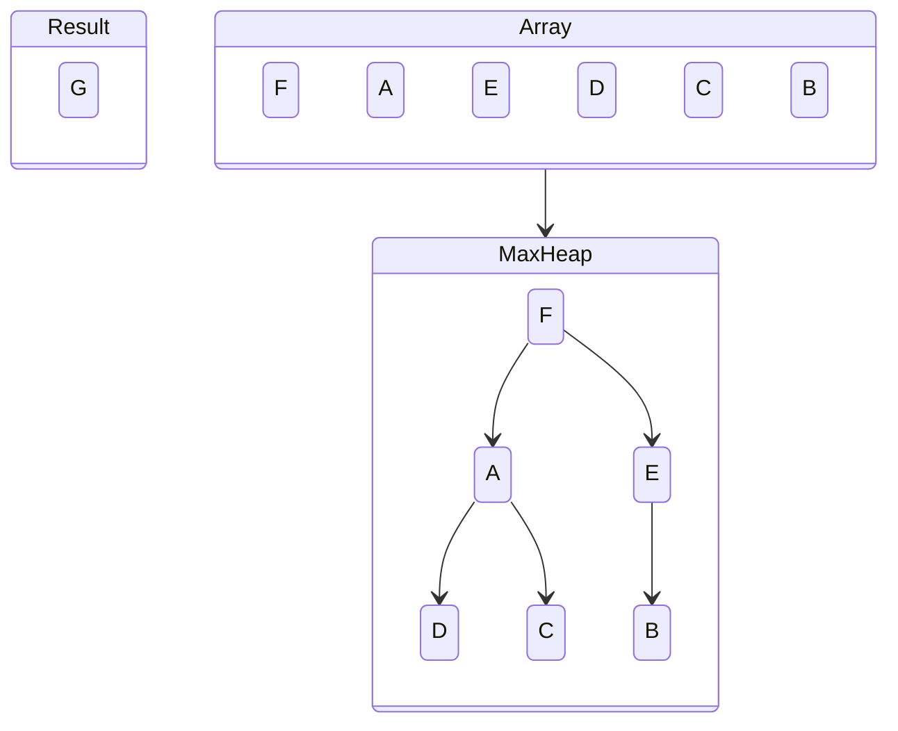
```mermaid
stateDiagram-v2
    state Result {
        G
    }
    state Array {
        f: F
        a: A
        e: E
        d: D
        c: C
        b: B
    }
    state MaxHeap {
        F --> A
        F --> E
        A --> D
        A --> C
        E --> B
    }
    Array --> MaxHeap
```

In this case there is nothing to do because F is greater than both of its children. Repeat.

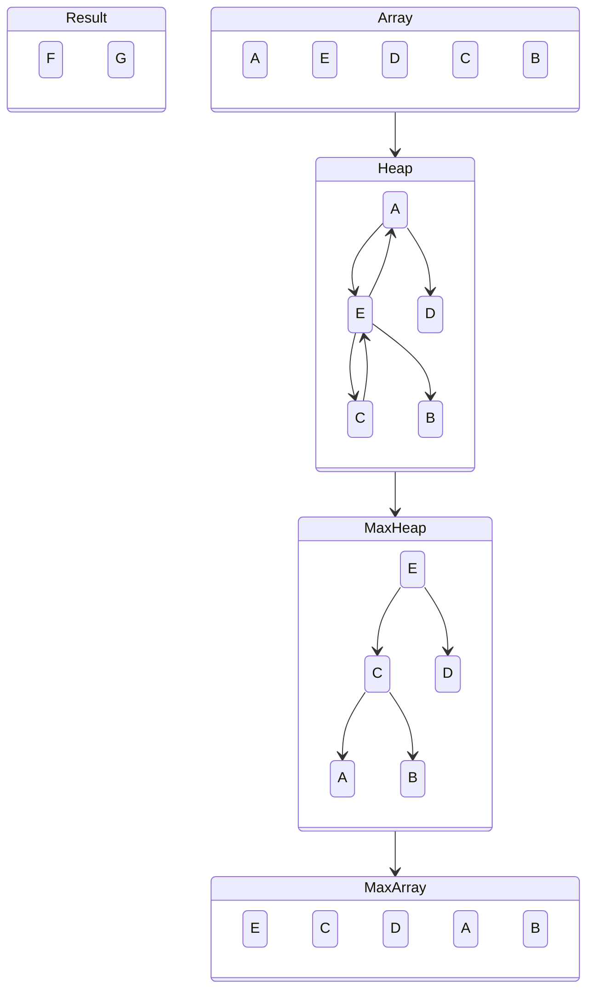
```mermaid
stateDiagram-v2
    state Result {
        F
        G
    }
    state Array {
        a: A
        e: E
        d: D
        c: C
        b: B
    }
    state Heap {
        A --> E
        E --> A
        A --> D
        E --> C
        C --> E
        E --> B
    }
    state MaxHeap {
        EE: E
        CC: C
        DD: D
        AA: A
        BB: B
        EE --> CC
        EE --> DD
        CC --> AA
        CC --> BB
    }
    state MaxArray {
        ee: E
        cc: C
        dd: D
        aa: A
        bb: B
    }
    Array --> Heap
    Heap --> MaxHeap
    MaxHeap --> MaxArray
```

E is greater than both A and D, so it gets swapped with A. Next, look at the part of the tree that was just affected. C is greater than both A and B, so C swaps with A.

This process continues similarly until the entire source array is empty.

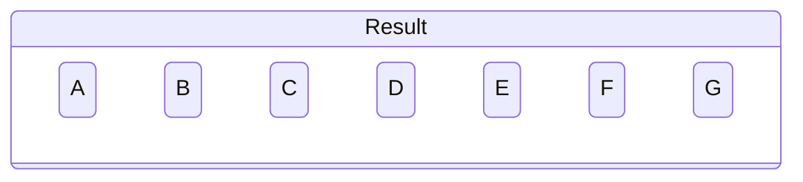
```mermaid
stateDiagram-v2
    state Result {
        A
        B
        C
        D
        E
        F
        G
    }

```

### Mergesort

The mergesort algorithm has two phases. The second and more significant phase deals with merging multiple small sorted arrays into one large sorted array, hence the name 'mergesort'. Combining two already sorted arrays in this way is trivial, and mergesort seeks to take advantage of that.

#### Splitting

The first phase consists of moving each element into its own array.

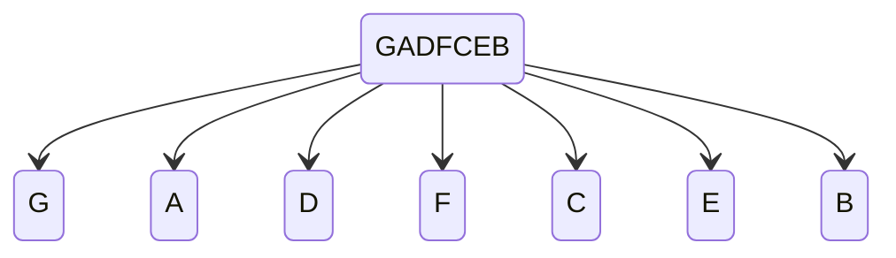
```mermaid
stateDiagram-v2
    GADFCEB --> G
    GADFCEB --> A
    GADFCEB --> D
    GADFCEB --> F
    GADFCEB --> C
    GADFCEB --> E
    GADFCEB --> B
```

#### Merging

The second phase is done iteratively over all the elements in the array, combining them together in groups of two at a time until there is only one left.

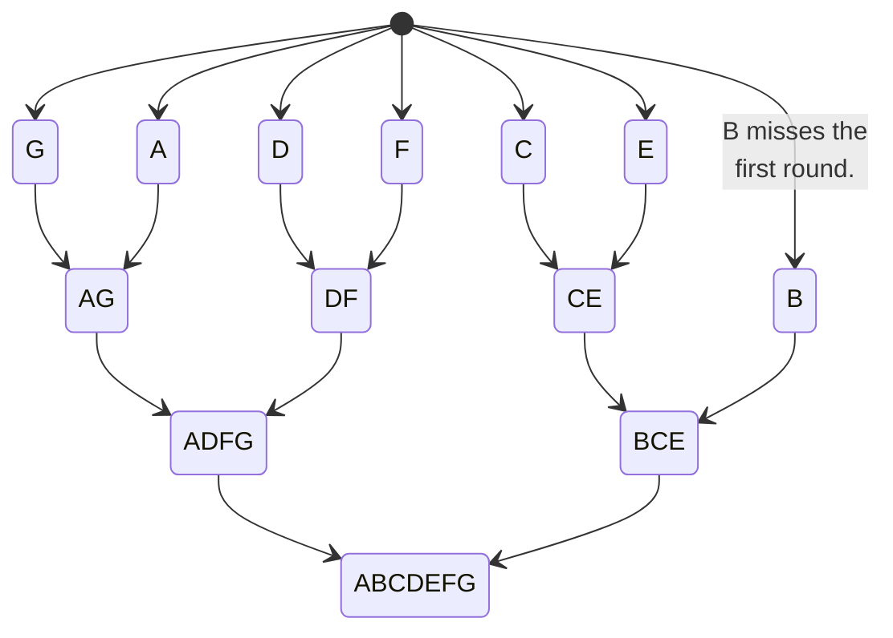
```mermaid
stateDiagram-v2
    [*] --> G
    [*] --> A
    [*] --> D
    [*] --> F
    [*] --> C
    [*] --> E
    [*] --> B: B misses the<br>first round.
    G --> AG
    A --> AG
    D --> DF
    F --> DF
    C --> CE
    E --> CE
    AG --> ADFG
    DF --> ADFG
    CE --> BCE
    B --> BCE
    ADFG --> ABCDEFG
    BCE --> ABCDEFG
```

The merging is done by pulling from whichever side has the smaller element next.

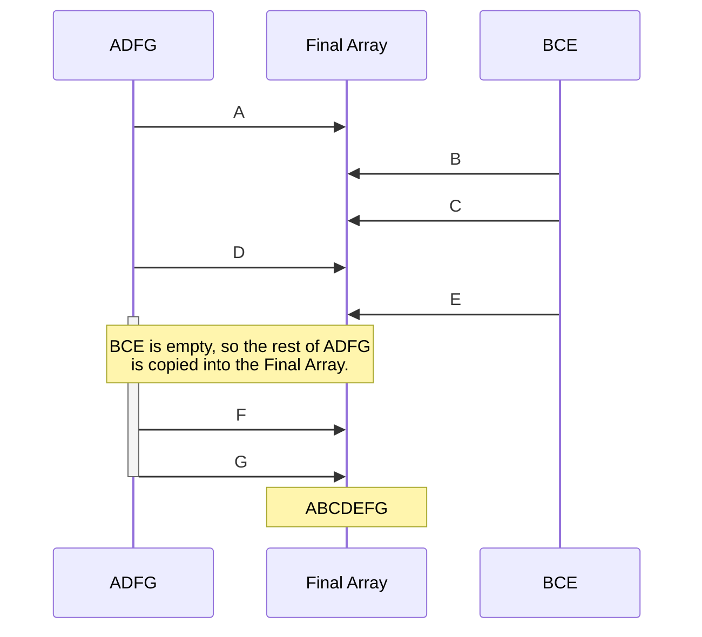
```mermaid
sequenceDiagram
    ADFG ->> Final Array: A
    BCE ->> Final Array: B
    BCE ->> Final Array: C
    ADFG ->> Final Array: D
    BCE ->> Final Array: E
    activate ADFG
    note over ADFG, Final Array: BCE is empty, so the rest of ADFG<br>is copied into the Final Array.
    ADFG ->> Final Array: F
    ADFG ->> Final Array: G
    deactivate ADFG
    note over Final Array: ABCDEFG
```

### Quick Sort

Quicksort is a sorting algorithm that works by establishing a `pivot` point in a given array and partitions it to sort.

In this case of quicksort, I used recursion and chose to use the `pivot` point at the end of the array. Below is a sample array we will use:

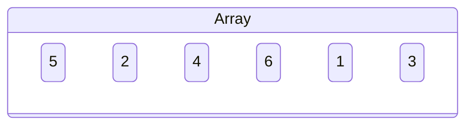
```mermaid
stateDiagram-v2
    direction LR
    state Array {
        five: 5
        two: 2
        four: 4
        six: 6
        one: 1
        three: 3
    }
```

If we take the last number of the above array (`3`) as our first `pivot`, we will create two partitions. One containing the numbers that are less than 3 and the other containing all numbers that are greater than `3`:

```mermaid
stateDiagram-v2
    
    state Pivot {
        three: 3
    }
    
    state Partition1 {
        two: 2
        one: 1
        four: 4
        six: 6
        three: 3
        two: 2
        one: 1
    }
    
    state Partition2 {
        five: 5
        four: 4
        six: 6
    }
    
    Pivot --> Partition1: Nums < 3
    Pivot --> Partition2: Nums > 3
    
    state SubPartition1(a) {
        2
    }
    
    Partition1 --> none1: Nums < 1
    Partition1 --> SubPartition1(a): Nums > 1
    
    state SubPartition2(a) {
        five1
        four1
    }
    
    Partition2 --> SubPartition2(a): Nums < 6
    Partition2 --> none2: Nums > 6
    
    SubPartition2(a) --> none3: Nums < 4
    SubPartition2(a) --> five2: Nums > 4
```

Now reading each of our `pivot`s values from left to right, quicksort will return an ordered array of:

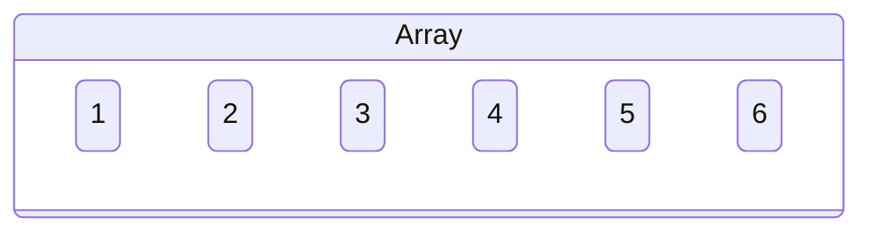
```mermaid
stateDiagram-v2
    direction LR
    state Array {
        one: 1
        two: 2
        three: 3
        four: 4
        five: 5
        six: 6
    }
```

### Shakersort

Shakersort is a sorting algorithm that will read individual elements of an array and sorts through them one at a time; Moving the largest elements it can find to the right side of the array and the smallest elements to the left.

To do this, we establish a `pointer` variable which will keep track of its current position in the array via the index of an element. 

The initial starting index for `pointer` will be the first element of the array, and it will compare the value of `pointer` to the value ahead of `pointer`. 

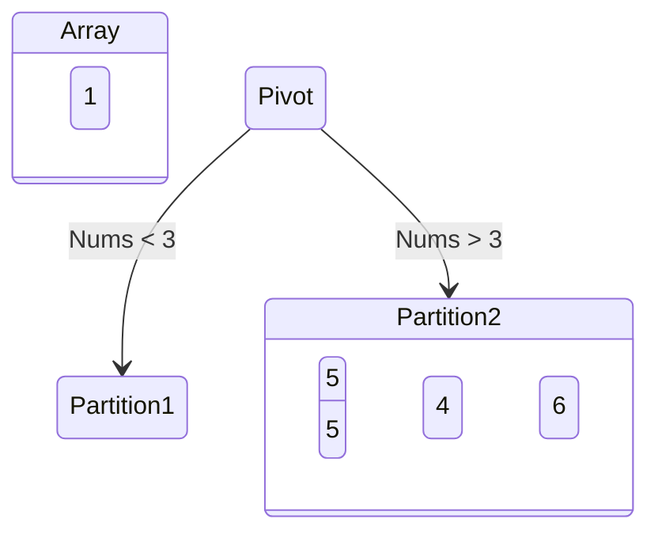
```mermaid
stateDiagram-v2
	classDef note fill:#fff4b1

    direction TB
    state Array {
	    direction LR
        five: 5
        one: 1
    }
    
    state Partition2 {
        five: 5
        four: 4
        six: 6
    }
    
    Pivot --> Partition1: Nums < 3
    Pivot --> Partition2: Nums > 3
```

After the partitions are created, it will repeat the `pivot` process again for each partition creating multiple branches to find the proper sorting order.

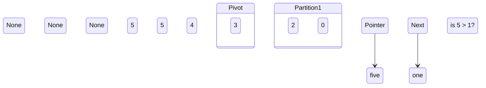
```mermaid
stateDiagram-v2
    
    state "None" as none1
    state "None" as none2
    state "None" as none3
    
    state "5" as five1
    state "5" as five2
    state "4" as four1
    
    state Pivot {
        three: 3
    }
    
    state Partition1 {
        two: 2
        zero: 0
    }
	Pointer --> five
	Next --> one
	Note: is 5 > 1?
	class Note note
```

If we take the above array and plug it into shakersort, our `pointer` will perform a forward pass by reading the array from left to right with `pointer` starting from the first item.

Our `pointer` is comparing the value of its current position (`5`) to the next value (`2`) to see if our `pointer` is greater than the next element.

Since `5` is greater than `2` we will swap both elements, increment our `pointer` to advance to the next comparison.

We will repeat this process of each element until `pointer` finds the largest value and moves it to the end of the array (in this case `6` should be at the end of the array):

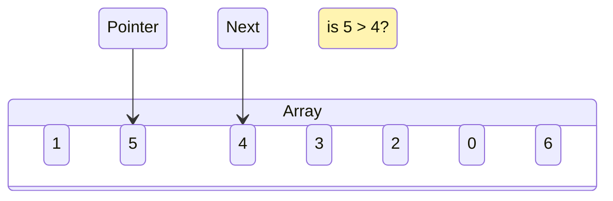
```mermaid
stateDiagram-v2
	classDef note fill:#fff4b1

    direction TB
    state Array {
	    direction LR
        one: 1
        five: 5
        four: 4
        three: 3
        two: 2
        zero: 0
        six: 6
    }
	Pointer --> five
	Next --> four
	Note: is 5 > 4?
	class Note note
```

We then update our `pointer` and its starting position to be the second to last element of the array, creating what we describe as a 'wall' to not venture past already sorted elements. 

Our `pointer` will do the opposite of what it did for the forward pass and performs a backward pass. 

When a backward pass begins, it will have `pointer` read from right to left to find the smallest element in the array and compare if the indexed value of `pointer` is less than the previous element to perform a swap.

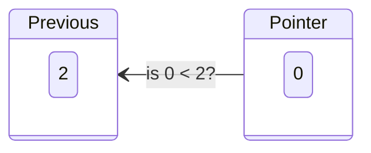
```mermaid
stateDiagram-v2
    direction RL
    
    state Pointer {
        zero: 0
    }
    
    state Previous {
        two: 2
    }
    
    Pointer --> Previous: is 0 < 2?
```

If true, then swap the compared elements, decrement and repeat this process until it reaches the beginning of the array for the first backwards pass:

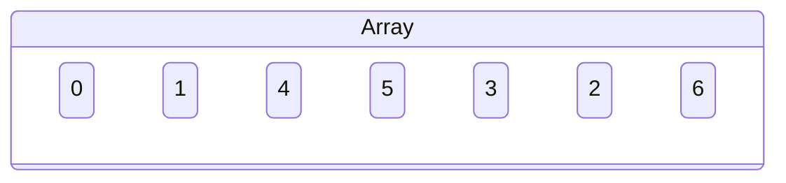
```mermaid
stateDiagram-v2
    direction LR
    state Array {
        zero: 0
        one: 1
        four: 4
        five: 5
        three: 3
        two: 2
        six: 6
    }
```

This is where our 'walls' will help out for already sorted elements as it will update the positioning of our `pointer` after multiple forward/backward passes. 

The idea of shakersort is that it will be slow to start but "spins up" faster with each completed pass until all individual elements are sorted through the array:

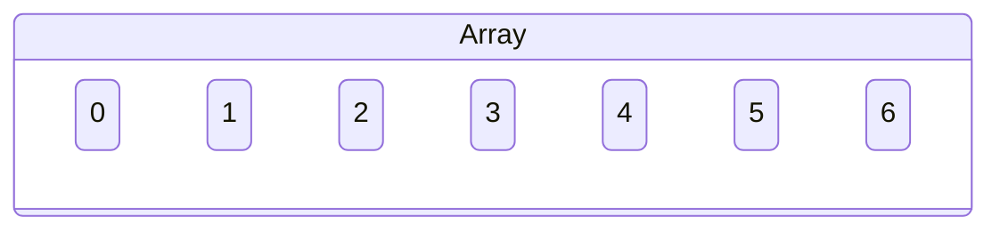
```mermaid
stateDiagram-v2
    direction LR
    state Array {
        zero: 0
        one: 1
        two: 2
        three: 3
        four: 4
        five: 5
        six: 6
    }
```

## Methods

### Permutation Generation

Permutations were generated using Python's built-in `itertools.permutations` function. We feed it `range(i)` for every `i` in the list of permutation sizes to use, in this case 4, 6, and 8.

### Comparison Counting

All of our are implemented in classes that inherit from the abstract `SortingAlgorithm` class. This class exposes both `compareLeast` and `compareMost`. All comparisons that the algorithms do between elements in the input array use these functions. Each time one of these functions is called, an internal `_comparison_count` variable is incremented. When the sort is finished, this variable can be checked to determine the total number of comparisons performed during that sort operation.

### Ensuring Fairness Across Algorithms

To ensure fairness across algorithms, the same `_analyze` function is used to instantiate, execute, and retrieve comparison count results from each algorithm. This way, if there is a bug outside any individual algorithm, then it wil affect all algorithms, not just one or two of them.

To ensure fairness within algorithms, we used the `SortingAlgorithm` parent class for all of them to make sure that they all count comparisons the same way.

One complication to this is the implementation of quicksort. While the others have limited leeway in how they can be implemented, quicksort has many different approaches, many of which can impact the comparison counts. To keep things fair, we chose to use a common approach to pivot selection in quicksort with the idea that it would give us typical performance for the algorithm in most cases.

To prevent bias towards one algorithm, we included every possible ordering of the numbers in the input. This prevents cases in which one algorithm performs worse than another from being hidden, thus artificially inflating that algorithm's performance. This ensures that we are providing the algorithms with consistent and wholistic inputs.

## Results

### Mergesort

---

#### 4 Elements - 24 Permutations

**Average Case:**

> $4.67$ element comparisons

**10 Worst Cases:**

| $5$            | $5$            | $5$            | $5$            | $5$            |
| -------------- | -------------- | -------------- | -------------- | -------------- |
| $(1, 3, 0, 2)$ | $(1, 3, 2, 0)$ | $(2, 0, 1, 3)$ | $(2, 0, 3, 1)$ | $(2, 1, 0, 3)$ |

| $5$            | $5$            | $5$            | $5$            | $5$            |
| -------------- | -------------- | -------------- | -------------- | -------------- |
| $(2, 1, 3, 0)$ | $(3, 0, 1, 2)$ | $(3, 0, 2, 1)$ | $(3, 1, 0, 2)$ | $(3, 1, 2, 0)$ |

**10 Best Cases:**

| $4$            | $4$            | $4$            | $4$            | $4$            |
| -------------- | -------------- | -------------- | -------------- | -------------- |
| $(0, 1, 2, 3)$ | $(0, 1, 3, 2)$ | $(1, 0, 2, 3)$ | $(1, 0, 3, 2)$ | $(2, 3, 0, 1)$ |

| $4$            | $4$            | $4$            | $5$            | $5$            |
| -------------- | -------------- | -------------- | -------------- | -------------- |
| $(2, 3, 1, 0)$ | $(3, 2, 0, 1)$ | $(3, 2, 1, 0)$ | $(0, 2, 1, 3)$ | $(0, 2, 3, 1)$ |

---

#### 6 Elements - 720 Permutations

**Average Case:**

> $9.93$ element comparisons

**10 Worst Cases:**

| $11$                 | $11$                 | $11$                 | $11$                 | $11$                 |
| -------------------- | -------------------- | -------------------- | -------------------- | -------------------- |
| $(5, 1, 3, 2, 0, 4)$ | $(5, 1, 3, 2, 4, 0)$ | $(5, 2, 0, 3, 1, 4)$ | $(5, 2, 0, 3, 4, 1)$ | $(5, 2, 1, 3, 0, 4)$ |

| $11$                 | $11$                 | $11$                 | $11$                 | $11$                 |
| -------------------- | -------------------- | -------------------- | -------------------- | -------------------- |
| $(5, 2, 1, 3, 4, 0)$ | $(5, 2, 3, 0, 1, 4)$ | $(5, 2, 3, 0, 4, 1)$ | $(5, 2, 3, 1, 0, 4)$ | $(5, 2, 3, 1, 4, 0)$ |

**10 Best Cases:**

| $7$                  | $7$                  | $7$                  | $7$                  | $7$                  |
| -------------------- | -------------------- | -------------------- | -------------------- | -------------------- |
| $(2, 3, 4, 5, 0, 1)$ | $(2, 3, 4, 5, 1, 0)$ | $(2, 3, 5, 4, 0, 1)$ | $(2, 3, 5, 4, 1, 0)$ | $(3, 2, 4, 5, 0, 1)$ |

| $7$                  | $7$                  | $7$                  | $7$                  | $7$                  |
| -------------------- | -------------------- | -------------------- | -------------------- | -------------------- |
| $(3, 2, 4, 5, 1, 0)$ | $(3, 2, 5, 4, 0, 1)$ | $(3, 2, 5, 4, 1, 0)$ | $(4, 5, 2, 3, 0, 1)$ | $(4, 5, 2, 3, 1, 0)$ |

---

#### 8 Elements - 40320 Permutations

**Average Case:**

> $15.73$ element comparisons

**10 Worst Cases:**

| $17$                       | $17$                       | $17$                       | $17$                       | $17$                       |
| -------------------------- | -------------------------- | -------------------------- | -------------------------- | -------------------------- |
| $(7, 4, 5, 3, 1, 6, 0, 2)$ | $(7, 4, 5, 3, 1, 6, 2, 0)$ | $(7, 4, 5, 3, 2, 0, 1, 6)$ | $(7, 4, 5, 3, 2, 0, 6, 1)$ | $(7, 4, 5, 3, 2, 1, 0, 6)$ |

| $17$                       | $17$                       | $17$                       | $17$                       | $17$                       |
| -------------------------- | -------------------------- | -------------------------- | -------------------------- | -------------------------- |
| $(7, 4, 5, 3, 2, 1, 6, 0)$ | $(7, 4, 5, 3, 6, 0, 1, 2)$ | $(7, 4, 5, 3, 6, 0, 2, 1)$ | $(7, 4, 5, 3, 6, 1, 0, 2)$ | $(7, 4, 5, 3, 6, 1, 2, 0)$ |

**10 Best Cases:**

| $12$                       | $12$                       | $12$                       | $12$                       | $12$                       |
| -------------------------- | -------------------------- | -------------------------- | -------------------------- | -------------------------- |
| $(0, 1, 2, 3, 4, 5, 6, 7)$ | $(0, 1, 2, 3, 4, 5, 7, 6)$ | $(0, 1, 2, 3, 5, 4, 6, 7)$ | $(0, 1, 2, 3, 5, 4, 7, 6)$ | $(0, 1, 2, 3, 6, 7, 4, 5)$ |

| $12$                       | $12$                       | $12$                       | $12$                       | $12$                       |
| -------------------------- | -------------------------- | -------------------------- | -------------------------- | -------------------------- |
| $(0, 1, 2, 3, 6, 7, 5, 4)$ | $(0, 1, 2, 3, 7, 6, 4, 5)$ | $(0, 1, 2, 3, 7, 6, 5, 4)$ | $(0, 1, 3, 2, 4, 5, 6, 7)$ | $(0, 1, 3, 2, 4, 5, 7, 6)$ |

---

### Heapsort

---

#### 4 Elements - 24 Permutations

**Average Case:**

> $8.50$ element comparisons

**10 Worst Cases:**

| $9$            | $9$            | $9$            | $9$            | $9$            |
| -------------- | -------------- | -------------- | -------------- | -------------- |
| $(0, 3, 1, 2)$ | $(0, 3, 2, 1)$ | $(1, 0, 2, 3)$ | $(1, 2, 0, 3)$ | $(1, 3, 0, 2)$ |

| $9$            | $9$            | $9$            | $9$            | $9$            |
| -------------- | -------------- | -------------- | -------------- | -------------- |
| $(1, 3, 2, 0)$ | $(2, 0, 1, 3)$ | $(2, 1, 0, 3)$ | $(2, 3, 0, 1)$ | $(2, 3, 1, 0)$ |

**10 Best Cases:**

| $8$            | $8$            | $8$            | $8$            | $8$            |
| -------------- | -------------- | -------------- | -------------- | -------------- |
| $(0, 1, 3, 2)$ | $(0, 2, 3, 1)$ | $(1, 0, 3, 2)$ | $(1, 2, 3, 0)$ | $(2, 0, 3, 1)$ |

| $8$            | $8$            | $8$            | $8$            | $8$            |
| -------------- | -------------- | -------------- | -------------- | -------------- |
| $(2, 1, 3, 0)$ | $(3, 0, 1, 2)$ | $(3, 0, 2, 1)$ | $(3, 1, 0, 2)$ | $(3, 1, 2, 0)$ |

---

#### 6 Elements - 720 Permutations

**Average Case:**

> $17.13$ element comparisons

**10 Worst Cases:**

| $19$                 | $19$                 | $19$                 | $19$                 | $19$                 |
| -------------------- | -------------------- | -------------------- | -------------------- | -------------------- |
| $(4, 5, 0, 3, 1, 2)$ | $(4, 5, 0, 3, 2, 1)$ | $(4, 5, 1, 0, 3, 2)$ | $(4, 5, 1, 2, 3, 0)$ | $(4, 5, 1, 3, 0, 2)$ |

| $19$                 | $19$                 | $19$                 | $19$                 | $19$                 |
| -------------------- | -------------------- | -------------------- | -------------------- | -------------------- |
| $(4, 5, 1, 3, 2, 0)$ | $(4, 5, 2, 0, 3, 1)$ | $(4, 5, 2, 1, 3, 0)$ | $(4, 5, 2, 3, 0, 1)$ | $(4, 5, 2, 3, 1, 0)$ |

**10 Best Cases:**

| $14$                 | $14$                 | $14$                 | $14$                 | $14$                 |
| -------------------- | -------------------- | -------------------- | -------------------- | -------------------- |
| $(5, 0, 3, 1, 2, 4)$ | $(5, 0, 3, 2, 1, 4)$ | $(5, 0, 4, 1, 2, 3)$ | $(5, 0, 4, 2, 1, 3)$ | $(5, 1, 3, 0, 2, 4)$ |

| $14$                 | $14$                 | $14$                 | $14$                 | $14$                 |
| -------------------- | -------------------- | -------------------- | -------------------- | -------------------- |
| $(5, 1, 3, 2, 0, 4)$ | $(5, 1, 4, 0, 2, 3)$ | $(5, 1, 4, 2, 0, 3)$ | $(5, 2, 3, 0, 1, 4)$ | $(5, 2, 3, 1, 0, 4)$ |

---

#### 8 Elements - 40320 Permutations

**Average Case:**

> $27.81$ element comparisons

**10 Worst Cases:**

| $31$                       | $31$                       | $31$                       | $31$                       | $31$                       |
| -------------------------- | -------------------------- | -------------------------- | -------------------------- | -------------------------- |
| $(5, 6, 1, 7, 4, 0, 2, 3)$ | $(5, 6, 1, 7, 4, 2, 0, 3)$ | $(5, 6, 2, 3, 4, 0, 1, 7)$ | $(5, 6, 2, 3, 4, 1, 0, 7)$ | $(5, 6, 2, 4, 3, 0, 1, 7)$ |

| $31$                       | $31$                       | $31$                       | $31$                       | $31$                       |
| -------------------------- | -------------------------- | -------------------------- | -------------------------- | -------------------------- |
| $(5, 6, 2, 4, 3, 1, 0, 7)$ | $(5, 6, 2, 7, 3, 0, 1, 4)$ | $(5, 6, 2, 7, 3, 1, 0, 4)$ | $(5, 6, 2, 7, 4, 0, 1, 3)$ | $(5, 6, 2, 7, 4, 1, 0, 3)$ |

**10 Best Cases:**

| $23$                       | $23$                       | $23$                       | $23$                       | $23$                       |
| -------------------------- | -------------------------- | -------------------------- | -------------------------- | -------------------------- |
| $(7, 0, 3, 1, 6, 4, 5, 2)$ | $(7, 0, 3, 1, 6, 5, 4, 2)$ | $(7, 0, 3, 2, 6, 4, 5, 1)$ | $(7, 0, 3, 2, 6, 5, 4, 1)$ | $(7, 0, 4, 1, 6, 3, 5, 2)$ |

| $23$                       | $23$                       | $23$                       | $23$                       | $23$                       |
| -------------------------- | -------------------------- | -------------------------- | -------------------------- | -------------------------- |
| $(7, 0, 4, 1, 6, 5, 3, 2)$ | $(7, 0, 4, 2, 6, 3, 5, 1)$ | $(7, 0, 4, 2, 6, 5, 3, 1)$ | $(7, 0, 5, 1, 6, 3, 4, 2)$ | $(7, 0, 5, 1, 6, 4, 3, 2)$ |

---

### Quicksort

---

#### 4 Elements - 24 Permutations

**Average Case:**

> $7.17$ element comparisons

**10 Worst Cases:**

| $7$            | $7$            | $9$            | $9$            | $9$            |
| -------------- | -------------- | -------------- | -------------- | -------------- |
| $(2, 1, 3, 0)$ | $(2, 3, 1, 0)$ | $(0, 1, 2, 3)$ | $(1, 0, 2, 3)$ | $(1, 2, 0, 3)$ |

| $9$            | $9$            | $9$            | $9$            | $9$            |
| -------------- | -------------- | -------------- | -------------- | -------------- |
| $(1, 2, 3, 0)$ | $(1, 3, 2, 0)$ | $(2, 1, 0, 3)$ | $(3, 1, 2, 0)$ | $(3, 2, 1, 0)$ |

**10 Best Cases:**

| $6$            | $6$            | $6$            | $6$            | $6$            |
| -------------- | -------------- | -------------- | -------------- | -------------- |
| $(0, 1, 3, 2)$ | $(0, 2, 3, 1)$ | $(0, 3, 1, 2)$ | $(0, 3, 2, 1)$ | $(1, 0, 3, 2)$ |

| $6$            | $6$            | $6$            | $6$            | $6$            |
| -------------- | -------------- | -------------- | -------------- | -------------- |
| $(1, 3, 0, 2)$ | $(2, 0, 3, 1)$ | $(2, 3, 0, 1)$ | $(3, 0, 1, 2)$ | $(3, 0, 2, 1)$ |

---

#### 6 Elements - 720 Permutations

**Average Case:**

> $13.97$ element comparisons

**10 Worst Cases:**

| $20$                 | $20$                 | $20$                 | $20$                 | $20$                 |
| -------------------- | -------------------- | -------------------- | -------------------- | -------------------- |
| $(4, 2, 3, 1, 0, 5)$ | $(4, 3, 2, 1, 0, 5)$ | $(5, 1, 2, 3, 4, 0)$ | $(5, 2, 1, 3, 4, 0)$ | $(5, 2, 3, 1, 4, 0)$ |

| $20$                 | $20$                 | $20$                 | $20$                 | $20$                 |
| -------------------- | -------------------- | -------------------- | -------------------- | -------------------- |
| $(5, 2, 3, 4, 1, 0)$ | $(5, 2, 4, 3, 1, 0)$ | $(5, 3, 2, 1, 4, 0)$ | $(5, 4, 2, 3, 1, 0)$ | $(5, 4, 3, 2, 1, 0)$ |

**10 Best Cases:**

| $11$                 | $11$                 | $11$                 | $11$                 | $11$                 |
| -------------------- | -------------------- | -------------------- | -------------------- | -------------------- |
| $(0, 1, 4, 3, 5, 2)$ | $(0, 1, 4, 5, 3, 2)$ | $(0, 2, 1, 4, 5, 3)$ | $(0, 2, 1, 5, 4, 3)$ | $(0, 2, 4, 1, 5, 3)$ |

| $11$                 | $11$                 | $11$                 | $11$                 | $11$                 |
| -------------------- | -------------------- | -------------------- | -------------------- | -------------------- |
| $(0, 2, 4, 5, 1, 3)$ | $(0, 2, 5, 1, 4, 3)$ | $(0, 2, 5, 4, 1, 3)$ | $(0, 3, 4, 1, 5, 2)$ | $(0, 3, 4, 5, 1, 2)$ |

---

#### 8 Elements - 40320 Permutations

**Average Case:**

> $21.92$ element comparisons

**10 Worst Cases:**

| $35$                       | $35$                       | $35$                       | $35$                       | $35$                       |
| -------------------------- | -------------------------- | -------------------------- | -------------------------- | -------------------------- |
| $(7, 5, 3, 4, 2, 1, 6, 0)$ | $(7, 5, 4, 3, 2, 1, 6, 0)$ | $(7, 6, 2, 3, 4, 5, 1, 0)$ | $(7, 6, 3, 2, 4, 5, 1, 0)$ | $(7, 6, 3, 4, 2, 5, 1, 0)$ |

| $35$                       | $35$                       | $35$                       | $35$                       | $35$                       |
| -------------------------- | -------------------------- | -------------------------- | -------------------------- | -------------------------- |
| $(7, 6, 3, 4, 5, 2, 1, 0)$ | $(7, 6, 3, 5, 4, 2, 1, 0)$ | $(7, 6, 4, 3, 2, 5, 1, 0)$ | $(7, 6, 5, 3, 4, 2, 1, 0)$ | $(7, 6, 5, 4, 3, 2, 1, 0)$ |

**10 Best Cases:**

| $17$                       | $17$                       | $17$                       | $17$                       | $17$                       |
| -------------------------- | -------------------------- | -------------------------- | -------------------------- | -------------------------- |
| $(0, 1, 3, 2, 6, 5, 7, 4)$ | $(0, 1, 3, 2, 6, 7, 5, 4)$ | $(0, 1, 3, 5, 6, 2, 7, 4)$ | $(0, 1, 3, 5, 6, 7, 2, 4)$ | $(0, 1, 3, 6, 2, 5, 7, 4)$ |

| $17$                       | $17$                       | $17$                       | $17$                       | $17$                       |
| -------------------------- | -------------------------- | -------------------------- | -------------------------- | -------------------------- |
| $(0, 1, 3, 6, 2, 7, 5, 4)$ | $(0, 1, 3, 7, 6, 2, 5, 4)$ | $(0, 1, 3, 7, 6, 5, 2, 4)$ | $(0, 1, 5, 3, 6, 2, 7, 4)$ | $(0, 1, 5, 3, 6, 7, 2, 4)$ |

---

### Shakersort

---

#### 4 Elements - 24 Permutations

**Average Case:**

> $15.00$ element comparisons

**10 Worst Cases:**

| $15$           | $15$           | $15$           | $15$           | $15$           |
| -------------- | -------------- | -------------- | -------------- | -------------- |
| $(2, 1, 0, 3)$ | $(2, 1, 3, 0)$ | $(2, 3, 0, 1)$ | $(2, 3, 1, 0)$ | $(3, 0, 1, 2)$ |

| $15$           | $15$           | $15$           | $15$           | $15$           |
| -------------- | -------------- | -------------- | -------------- | -------------- |
| $(3, 0, 2, 1)$ | $(3, 1, 0, 2)$ | $(3, 1, 2, 0)$ | $(3, 2, 0, 1)$ | $(3, 2, 1, 0)$ |

**10 Best Cases:**

| $15$           | $15$           | $15$           | $15$           | $15$           |
| -------------- | -------------- | -------------- | -------------- | -------------- |
| $(0, 1, 2, 3)$ | $(0, 1, 3, 2)$ | $(0, 2, 1, 3)$ | $(0, 2, 3, 1)$ | $(0, 3, 1, 2)$ |

| $15$           | $15$           | $15$           | $15$           | $15$           |
| -------------- | -------------- | -------------- | -------------- | -------------- |
| $(0, 3, 2, 1)$ | $(1, 0, 2, 3)$ | $(1, 0, 3, 2)$ | $(1, 2, 0, 3)$ | $(1, 2, 3, 0)$ |

---

#### 6 Elements - 720 Permutations

**Average Case:**

> $30.00$ element comparisons

**10 Worst Cases:**

| $30$                 | $30$                 | $30$                 | $30$                 | $30$                 |
| -------------------- | -------------------- | -------------------- | -------------------- | -------------------- |
| $(5, 4, 2, 1, 0, 3)$ | $(5, 4, 2, 1, 3, 0)$ | $(5, 4, 2, 3, 0, 1)$ | $(5, 4, 2, 3, 1, 0)$ | $(5, 4, 3, 0, 1, 2)$ |

| $30$                 | $30$                 | $30$                 | $30$                 | $30$                 |
| -------------------- | -------------------- | -------------------- | -------------------- | -------------------- |
| $(5, 4, 3, 0, 2, 1)$ | $(5, 4, 3, 1, 0, 2)$ | $(5, 4, 3, 1, 2, 0)$ | $(5, 4, 3, 2, 0, 1)$ | $(5, 4, 3, 2, 1, 0)$ |

**10 Best Cases:**

| $30$                 | $30$                 | $30$                 | $30$                 | $30$                 |
| -------------------- | -------------------- | -------------------- | -------------------- | -------------------- |
| $(0, 1, 2, 3, 4, 5)$ | $(0, 1, 2, 3, 5, 4)$ | $(0, 1, 2, 4, 3, 5)$ | $(0, 1, 2, 4, 5, 3)$ | $(0, 1, 2, 5, 3, 4)$ |

| $30$                 | $30$                 | $30$                 | $30$                 | $30$                 |
| -------------------- | -------------------- | -------------------- | -------------------- | -------------------- |
| $(0, 1, 2, 5, 4, 3)$ | $(0, 1, 3, 2, 4, 5)$ | $(0, 1, 3, 2, 5, 4)$ | $(0, 1, 3, 4, 2, 5)$ | $(0, 1, 3, 4, 5, 2)$ |

---

#### 8 Elements - 40320 Permutations

**Average Case:**

> $50.00$ element comparisons

**10 Worst Cases:**

| $50$                       | $50$                       | $50$                       | $50$                       | $50$                       |
| -------------------------- | -------------------------- | -------------------------- | -------------------------- | -------------------------- |
| $(7, 6, 5, 4, 2, 1, 0, 3)$ | $(7, 6, 5, 4, 2, 1, 3, 0)$ | $(7, 6, 5, 4, 2, 3, 0, 1)$ | $(7, 6, 5, 4, 2, 3, 1, 0)$ | $(7, 6, 5, 4, 3, 0, 1, 2)$ |

| $50$                       | $50$                       | $50$                       | $50$                       | $50$                       |
| -------------------------- | -------------------------- | -------------------------- | -------------------------- | -------------------------- |
| $(7, 6, 5, 4, 3, 0, 2, 1)$ | $(7, 6, 5, 4, 3, 1, 0, 2)$ | $(7, 6, 5, 4, 3, 1, 2, 0)$ | $(7, 6, 5, 4, 3, 2, 0, 1)$ | $(7, 6, 5, 4, 3, 2, 1, 0)$ |

**10 Best Cases:**

| $50$                       | $50$                       | $50$                       | $50$                       | $50$                       |
| -------------------------- | -------------------------- | -------------------------- | -------------------------- | -------------------------- |
| $(0, 1, 2, 3, 4, 5, 6, 7)$ | $(0, 1, 2, 3, 4, 5, 7, 6)$ | $(0, 1, 2, 3, 4, 6, 5, 7)$ | $(0, 1, 2, 3, 4, 6, 7, 5)$ | $(0, 1, 2, 3, 4, 7, 5, 6)$ |

| $50$                       | $50$                       | $50$                       | $50$                       | $50$                       |
| -------------------------- | -------------------------- | -------------------------- | -------------------------- | -------------------------- |
| $(0, 1, 2, 3, 4, 7, 6, 5)$ | $(0, 1, 2, 3, 5, 4, 6, 7)$ | $(0, 1, 2, 3, 5, 4, 7, 6)$ | $(0, 1, 2, 3, 5, 6, 4, 7)$ | $(0, 1, 2, 3, 5, 6, 7, 4)$ |

---

## Analysis

### Estimated Big-$O$, Big-$\Omega$, and Big-$\Theta$:

#### Overview Table:

| Sort Algorithm |     Big-$\Omega$     |     Big-$\Theta$     |     Big-$O$     |
|:--------------:|:--------------------:|:--------------------:|:---------------:|
|    Heapsort    | $\Omega(n \log_2 n)$ | $\Theta(n \log_2 n)$ | $O(n \log_2 n)$ |
|   Mergesort    | $\Omega(n \log_2 n)$ | $\Theta(n \log_2 n)$ | $O(n \log_2 n)$ |
|   Quicksort    | $\Omega(n \log_2 n)$ | $\Theta(n \log_2 n)$ |    $O(n^2)$     |
|   Shakersort   |     $\Omega(n)$      |    $\Theta(n^2)$     |    $O(n^2)$     |

#### Reasoning
##### Heapsort

- **$\Omega(n \log_2 n)$ Best Case:** Building a max-heap takes $O(n)$ time. Even if all elements are identical or ideal, extracting the root and calling `_heapify` $n-1$ times requires traversing down the binary tree height of $\lfloor \log_2 k \rfloor$ at each step, yielding a lower bound of $\Omega(n \log_2 n)$.
    
- **$\Theta(n \log_2 n)$ Average Case:** For a random permutation, each extracted element must sink down near the bottom of the heap during restoration, performing $\approx \log_2 k$ comparisons per element. The sum $\displaystyle \sum_{k=1}^{n} \log_2 k = \log_2(n!) = \Theta(n \log_2 n)$.
    
- **$O(n \log_2 n)$ Worst Case:** The tree height is strictly bounded by $\lfloor \log_2 n \rfloor$. Because each of the $N$ extractions performs at most $2 \lfloor \log_2 n \rfloor$ comparisons during reheapification, total runtime never exceeds $O(n \log_2 n)$.

##### Mergesort

- **$\Omega(n \log_2 n)$ Best Case:** Mergesort -unconditionally pairs adjacent sublists bottom-up from single-element lists, executing across $\lceil \log_2 n \rceil$ passes. Even on sorted input, merging two sorted sublists of size $\dfrac{k}{2}$ executes at least $\dfrac{k}{2}$ comparisons in `_merge` before exhausting a sublist. When fully evaluated via `list(a[0])`, the total comparisons across all passes yield $\Omega(n \log n)$.
    
- **$\Theta(n \log_2 n)$ Average Case:** By the Master Theorem, the recurrence $T(n) = 2T(\frac{n}{2}) + \Theta(n)$ falls into Case 2 ($f(n) = \Theta(n^{\log_2 2})$), which evaluates to $\Theta(n \log_2 n)$.
    
- **$O(n \log_2 n)$ Worst Case:** Merging two sorted arrays of combined size $k$ takes at most $k - 1$ comparisons. Summing the work across all $\log_2 n$ levels of the recursion tree yields an absolute upper bound of $O(n \log_2 n)$.

##### Quicksort

- **$\Omega(n \log_2 n)$ Best Case:** Occurs when the pivot choice splits the array into two equal halves at every step ($q = \lfloor \frac{n}{2} \rfloor$). The recurrence $T(n) = 2T(\frac{n}{2}) + O(n)$ yields an optimal lower bound of $\Omega(n \log_2 n)$.
    
- **$\Theta(n \log_2 n)$ Average Case:** Assuming a uniform distribution over pivot choices ($P(q) = \frac{1}{n}$), the average depth of the recursion tree remains logarithmic ($2 \ln n \approx 1.39 \log_2 n$), giving an average tight bound of $\Theta(n \log_2 n)$.
    
- **$O(n^2)$ Worst Case:** Occurs when the pivot is consistently the minimum or maximum element (e.g., sorted array with first/last element chosen as pivot). The recurrence degrades to $T(n) = T(n - 1) + O(n)$, yielding a summation $\displaystyle \sum_{i=1}^{n} i = \frac{n(n+1)}{2} = O(n^2)$.

##### Shakersort

- **$\Omega(n)$ Best Case:** Shakersort is a bidirectional variation of Bubble Sort. On an already sorted array, a single forward pass makes $n - 1$ comparisons, detects zero swaps, and terminates early via its boolean swap flag in $\Omega(\frac{1}{4}n^2)$ time.
    
- **$\Theta(n^2)$ Average Case:** On a random permutation, the expected number of inverted pairs (inversions) is $\frac{n(n - 1)}{4}$. Because adjacent swaps only eliminate 1 inversion per comparison, the average total operations remain quadratic: $\Theta(n^2)$.
    
- **$O(n^2)$ Worst Case:** On a reverse-sorted array, every adjacent pair is an inversion ($\frac{n(n - 1)}{2}$ inversions). The algorithm requires $\frac{n}{2}$ full double-passes of $O(n)$ comparisons each, yielding an upper bound of $O(n^2)$.

### Best and Worst Case Sensitivity

Looking at the results tables, shakersort and mergesort are the most stable algorithms. Shakersort is constant with a given input size, and mergesort varies only slightly. On the other hand, heapsort and quicksort are the most volatile. Heapsort diverges by up to eight comparisons and quicksort by 18.

This means that some algorithms are more divergent than others. Shakersort is the least divergent because it does not change at all what it does based on the values of the numbers. Quicksort is the most divergent because its pivot, its entire approach to sorting, is based on the value at a given position.

### Predicted number of comparisons for $N=12$

| **Algorithm**  | **$C(4)$ (Measured)** | **$C(8)$ (Measured)** | **Empirical Growth Exponent ($k$)** | **$C(12)$ (Projected)** |
|----------------|-----------------------|-----------------------|-------------------------------------|-------------------------|
| **Mergesort**  | $4.67$                | $15.73$               | $1.752$                             | **$32.01$**             |
| **Quicksort**  | $7.17$                | $21.92$               | $1.612$                             | **$42.14$**             |
| **Heapsort**   | $8.50$                | $27.81$               | $1.710$                             | **$55.63$**             |
| **Shakersort** | $15.00$               | $50.00$               | $1.737$                             | **$101.12$**            |

#### Formulas used to predict results:

| **Variable**     | **Description**                                           |
| ---------------- | --------------------------------------------------------- |
| $n_1, n_2$       | Initial baseline input sizes ($n_1 = 4$, $n_2 = 8$)       |
| $n_3$            | Projection target size ($n_3 = 12$)                       |
| $C(n_1), C(n_2)$ | Measured comparison counts at input sizes $n_1$ and $n_2$ |
| $C(n_3)$         | Projected comparison count at target input size $n_3$     |
| $k$              | Empirical Growth Exponent                                 |

$$
\begin{aligned}
  \text{Step 1: }& \\ k &= \frac{\log(\frac{C(n_2)}{C(n_1)})}{\log(\frac{n_2}{n_1})}  \\
  \text{Step 2: }& \\ C(n_3) &= C(n_2) \cdot (\frac{n_3}{n_2})^k
\end{aligned}
$$

### Algorithm Performance Comparison

The best performing algorithm by number of comparisons is mergesort. Mergesort performs the fewest comparisons in every case regardless of $N$.

> If examining mergesort in the profiler, mergesort consistently performs the worst, until it is surpassed by shakersort at sufficiently high values of $N$. The profiler reveals that for $N\in{4,6,8}$, heapsort actually performs the best in all cases.

As $N$ scales, the empirical exponent $k$ for mergesort, heapsort, and quicksort will fall from our small-sample values ($\sim 1.6\text{-}1.75$) toward $1.0$ as logarithmic growth dominates, while shakersort's $k$ will rise from $\sim 1.74$ toward $2.0$ as quadratic comparisons drown out lower-order overhead.

### Why Results May Vary

Our quicksort results may differ from other implementations because we chose the end of the array as a constant pivot point. Other implementations of quicksort may have chosen differently, and this choice can have significant impacts on the efficiency of the implementation. Many other potential differences between our implementations and others' are unrelated to the complexity of the algorithms. Though they may affect performance for a given $N$, they do not change how the algorithm *scales* to larger $N$.

## Conclusion

### Reflection

Mermaid made visualizing easier while improving the quality of our work on these algorithms. 

Organization and coordination were initial pain points when navigating through our project objectives trying to get everyone on the same page. However, we were able to address this by exchanging contacts, meeting up outside of class, and constantly referring to our project requirements to garner what needed to get done, by who and when.

Other obstacles we faced were ideas or concepts ballooning when approaching how to implement algorithms, and differentiating between declarative and imperative programming paradigms.

#### Thaddeus Schelp

Todd introduced me to the idea of 'Who does What by When'. This is a useful way to think about organizing tasks and divvying them up. Making sure that you are actively aware of each of these Ws can help drive a team and keep them coordinated on tasks.

This project also got me thinking more critically about performance analysis using proxy measures, particularly not taking the validity of the proxy for granted.

I was surprised by mergesort's comparatively horrible performance, and on the contrary, heapsort's comparatively stellar performance.

#### Brayden Graham

Thaddeus introduced me to Mermaid for creating diagrams and $\LaTeX$ for formatting formulas directly in Markdown. Both are great tools that I can implement into personal and work projects going forward. They will help me better present charts and formulas in my documentation rather than embedding images from services like Lucidchart, while also making it easier to update and maintain. In this project, I was also introduced to OOP in Python, which I didn't know was possible, as I had previously avoided Python in favor of lower-level, non-interpreted languages.

## Sources

Geeks for Geeks' article on *Heap Sort*. Last updated on 5 Feb, 2026. Accessed 17 Sep, 2026. https://www.geeksforgeeks.org/dsa/heap-sort/

Geeks for Geeks' article on *Merge Sort*. Last updated on 6 Aug, 2026. Accessed 16 Sep, 2026. https://www.geeksforgeeks.org/dsa/merge-sort/

Geeks for Geeks' article on *Quick Sort*. Last updated on 5 Aug, 2026. Accessed 23 Sep, 2026. https://www.geeksforgeeks.org/dsa/quick-sort-algorithm/

Geeks for Geeks' article on *Cocktail Sort*. Last updated on 5 Sep, 2023. Accessed 24 Sep, 2026. https://www.geeksforgeeks.org/dsa/cocktail-sort/
